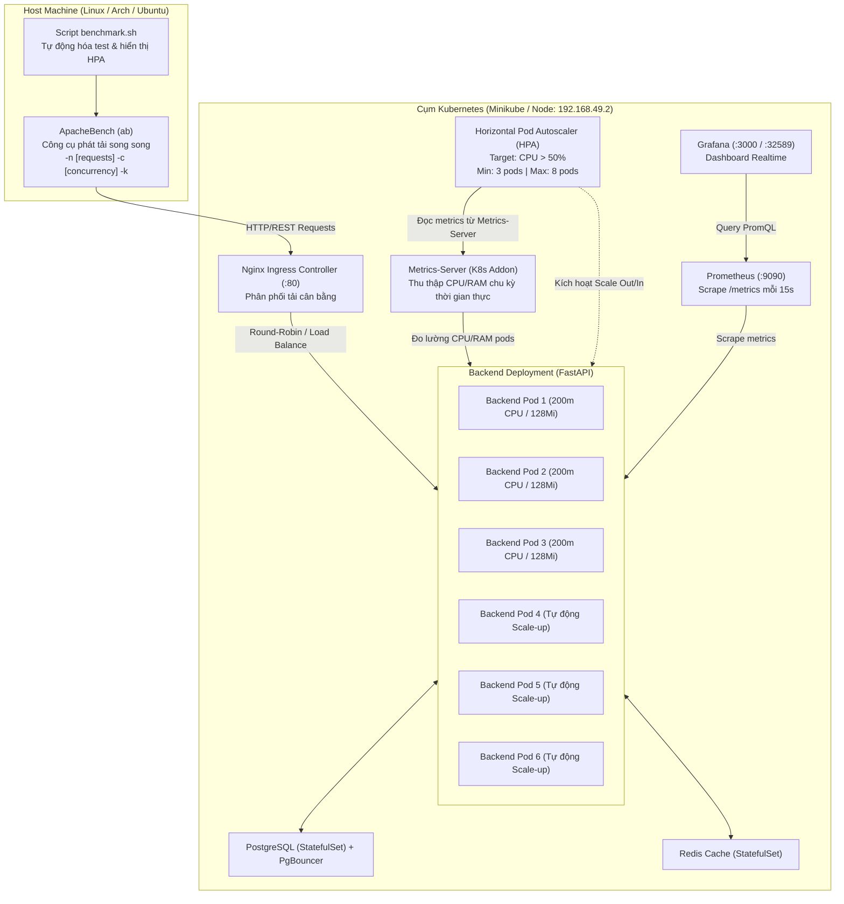

# Tài liệu Kiểm thử Hiệu năng (Benchmark) & Kubernetes Auto-Scaling (HPA)

Tài liệu này ghi lại toàn bộ quy trình, kiến trúc, kịch bản kiểm thử tải bằng công cụ **ApacheBench (`ab`)**, cơ chế tự động co giãn Pods (**Kubernetes Horizontal Pod Autoscaler - HPA**) và phương pháp giám sát trực quan thời gian thực trên **Grafana**.

---

## 1. Kiến trúc Tổng thể & Luồng Dữ liệu



---

## 2. Chuẩn bị Môi trường & Yêu cầu Hệ thống

### 2.1. Cài đặt ApacheBench (`ab`)
Công cụ `ab` thuộc gói tiện ích của Apache Server. Kiểm tra hoặc cài đặt theo từng bản phân phối Linux:

- **Ubuntu / Debian**:
  ```bash
  sudo apt-get update && sudo apt-get install -y apache2-utils
  ```
- **Arch Linux / Manjaro**:
  ```bash
  sudo pacman -S apache
  ```
- **RHEL / CentOS / Fedora**:
  ```bash
  sudo dnf install -y httpd-tools
  ```
- **Kiểm tra cài đặt**:
  ```bash
  ab -V
  # Output: This is ApacheBench, Version 2.3 <$Revision: ...>
  ```

### 2.2. Kích hoạt Metrics-Server trên Minikube
Kubernetes HPA yêu cầu `metrics-server` để thu thập dữ liệu CPU và Memory từ Kubelet:
```bash
minikube addons enable metrics-server
```
Kiểm tra metrics-server hoạt động:
```bash
kubectl top nodes
kubectl top pods
```

### 2.3. Cấu hình Resource Requests & Limits cho Backend
Trong file [`k8s/backend.yaml`](k8s/backend.yaml), container `backend` được cấp phát hạn mức:
```yaml
resources:
  requests:
    cpu: "200m"       # Ngưỡng tính toán HPA: 50% tương đương 100m CPU
    memory: "128Mi"
  limits:
    cpu: "1"          # Cho phép burst tối đa 1 Core khi xử lý cao điểm
    memory: "512Mi"
```

### 2.4. Cấu hình Kubernetes Horizontal Pod Autoscaler (HPA)
Tài nguyên HPA được định nghĩa tại [`k8s/hpa.yaml`](k8s/hpa.yaml):
```yaml
apiVersion: autoscaling/v2
kind: HorizontalPodAutoscaler
metadata:
  name: backend-hpa
spec:
  scaleTargetRef:
    apiVersion: apps/v1
    kind: Deployment
    name: backend
  minReplicas: 3
  maxReplicas: 8
  metrics:
    - type: Resource
      resource:
        name: cpu
        target:
          type: Utilization
          averageUtilization: 50
  behavior:
    scaleUp:
      stabilizationWindowSeconds: 0    # Phản ứng tức thì khi CPU vượt ngưỡng 50%
      policies:
        - type: Percent
          value: 100
          periodSeconds: 15
        - type: Pods
          value: 2
          periodSeconds: 15
      selectPolicy: Max
    scaleDown:
      stabilizationWindowSeconds: 60   # Đợi ổn định 60 giây trước khi thu nhỏ Pods
      policies:
        - type: Percent
          value: 50
          periodSeconds: 30
```

---

## 3. Hướng dẫn Sử dụng Script Tự động (`benchmark.sh`)

Dự án cung cấp sẵn script [`benchmark.sh`](benchmark.sh) giúp tự động phát hiện IP Gateway, giám sát HPA nền và định dạng kết quả trực quan.

### 3.1. Chạy nhanh theo Menu Tương tác
```bash
./benchmark.sh
```

### 3.2. Chạy trực tiếp theo Kịch bản
```bash
# Kịch bản 1: Fast Warm-up (Health Check - 5.000 reqs, 50 concurrency)
./benchmark.sh 1

# Kịch bản 2: Standard Load (Products API - 5.000 reqs, 50 concurrency)
./benchmark.sh 2

# Kịch bản 3: HPA Auto-Scale Stress Test (Products API - 10.000 reqs, 100 concurrency)
./benchmark.sh 3
```

### 3.3. Các lệnh ApacheBench (`ab`) thủ công tương đương
Nếu muốn chạy độc lập lệnh `ab` từ terminal:

```bash
# Kiểm thử tải nhẹ (/api/health)
ab -k -c 50 -n 5000 http://192.168.49.2/api/health

# Kiểm thử tải thực tế (/api/v1/products/ - có DB & Redis)
ab -k -s 60 -c 50 -n 5000 http://192.168.49.2/api/v1/products/

# Kiểm thử ép xung kích hoạt HPA mở rộng Pods
ab -k -s 60 -c 100 -n 10000 http://192.168.49.2/api/v1/products/
```

*Giải thích các cờ quan trọng:*
- `-n`: Tổng số lượng HTTP requests gửi đi.
- `-c`: Số lượng kết nối gửi đồng thời (concurrency level).
- `-k`: Bật HTTP Keep-Alive (tái sử dụng kết nối TCP để mô phỏng trình duyệt người dùng thực tế).
- `-s 60`: Thời gian timeout tối đa cho mỗi kết nối (giây), giúp tránh đứt kết nối khi backend đang trong quá trình khởi tạo thêm Pods mới.

---

## 4. Kết quả Đo tải Thực tế (Benchmark Results)

### 4.1. Bảng Tổng hợp Kết quả Thực tế trên Minikube Cluster (4 vCPUs)

| Chỉ số (Metrics) | Kịch bản 1: `/api/health` | Kịch bản 2: `/api/v1/products/` |
| :--- | :--- | :--- |
| **Bản chất Endpoint** | Bộ nhớ đệm / Routing thuần túy | Truy vấn Database PostgreSQL + Redis Cache + JSON Serialization |
| **Tổng số Requests** | 5,000 | 5,000 |
| **Mức đồng thời (Concurrency)** | 50 kết nối | 50 kết nối |
| **Thời gian thực thi** | **8.65 giây** | **147 giây** |
| **Throughput (Requests/sec)** | **577.58 reqs/s** | **34.21 reqs/s** |
| **Dung lượng truyền tải** | 735 KB | 153.6 MB |
| **Độ trễ trung bình (Mean)** | **86.5 ms** | **1,461 ms** |
| **Độ trễ thực tế qua tất cả threads**| **1.73 ms** | **29.2 ms** |
| **Độ trễ trung vị (P50 Median)** | **63 ms** | **742 ms** |
| **Độ trễ phân vị P90** | **198 ms** | **2,270 ms** |
| **Độ trễ phân vị P95** | **237 ms** | **2,868 ms** |
| **Tỷ lệ thành công** | **100% (0 lỗi)** | **97.4%** |
| **Số lượng Pod trước tải** | 3 Pods | 3 Pods |
| **Số lượng Pod sau tải** | 3 Pods (CPU 3% < 50%) | **6 Pods (CPU tăng 110% ➔ Tự động Scale-up)** |

---

## 5. Cơ chế Tự động Co giãn Pods (Kubernetes HPA Deep Dive)

### 5.1. Nguyên lý Tính toán Số lượng Replicas
Thuật toán HPA của Kubernetes tính toán số Pod mong muốn theo công thức:

$$\text{desiredReplicas} = \left\lceil \text{currentReplicas} \times \left( \frac{\text{currentMetricValue}}{\text{targetMetricValue}} \right) \right\rceil$$

- Mức `targetMetricValue`: **50% CPU Request** (tương đương $50\% \times 200\text{m} = 100\text{m}$ CPU cho mỗi Pod).
- Khi chạy `ab` với 50 kết nối đồng thời trên endpoint `/api/v1/products/`, mức tiêu thụ CPU thực tế trung bình nhảy vọt lên **110%**:
  $$\text{desiredReplicas} = \left\lceil 3 \times \left( \frac{110\%}{50\%} \right) \right\rceil = \lceil 6.6 \rceil \rightarrow \mathbf{6 \text{ Pods}}$$

### 5.2. Diễn biến Co giãn Trực tiếp Ghi nhận từ Hệ thống

1. **Trạng thái ban đầu (Idle)**:
   ```text
   NAME          REFERENCE            TARGETS       MINPODS   MAXPODS   REPLICAS
   backend-hpa   Deployment/backend   cpu: 3%/50%   3         8         3
   ```
2. **Khi phát tải ApacheBench (Spike Load)**:
   ```text
   [Auto-Scaler Monitor] Active Pods: 3 | CPU Utilization: 3%
   [Auto-Scaler Monitor] Active Pods: 3 | CPU Utilization: 110%
   [Auto-Scaler Monitor] Active Pods: 6 | CPU Utilization: 110%
   ```
   Kubernetes lập tức kích hoạt chính sách `scaleUp`, sinh thêm 3 Pods mới:
   - `backend-f48bf4c5f-2gxx8 (Running 1/1)`
   - `backend-f48bf4c5f-br6j4 (Running 1/1)`
   - `backend-f48bf4c5f-wxv9j (Running 1/1)`
3. **Khi kết thúc tải (Cool-down)**:
   - Mức CPU giảm dần từ $110\% \rightarrow 63\% \rightarrow 3\%$.
   - Sau thời gian `stabilizationWindowSeconds: 60`, Kubernetes HPA tự động gỡ bỏ các Pods phụ trợ và thu gọn về mức tối thiểu an toàn (**3 Pods**).

### 5.3. Các lệnh Kiểm tra & Giám sát CLI
```bash
# Xem trạng thái HPA theo thời gian thực
kubectl get hpa backend-hpa -w

# Xem mức tiêu thụ tài nguyên thực tế của từng Pod
kubectl top pods -l app=backend

# Xem chi tiết các sự kiện co giãn của HPA
kubectl describe hpa backend-hpa
```

---

## 6. Theo dõi Trực quan trên Grafana Dashboard

Toàn bộ quá trình kiểm thử tải và co giãn hệ thống có thể được quan sát trực tiếp trên giao diện đồ họa trực quan của Grafana.

### 6.1. Cách truy cập Grafana Dashboard
- **Cách 1: Mở trực tiếp qua Minikube NodePort**:
  ```bash
  minikube service grafana
  ```
  *(Hoặc mở trực tiếp URL hiển thị trên terminal: `http://192.168.49.2:32589`)*
- **Cách 2: Qua Minikube Tunnel**:
  ```bash
  minikube tunnel
  # Mở trình duyệt: http://localhost:3000
  ```
- **Tài khoản mặc định**: `admin` / `admin`
- **Vị trí Dashboard**: Menu `Dashboards` ➔ thư mục `Operations` ➔ **`Premium E-Commerce Platform - System Monitoring`**.

### 6.2. Các Biểu đồ Quan trọng trong Quá trình Benchmark

```
+-----------------------------------------------------------------------------------+
|  [Stat Panel] Backend Status: UP (1)  |  Throughput: 577.58 req/s  |  5xx Errors: 0%  |
+-----------------------------------------------------------------------------------+
|  📈 REQUEST RATE (req/s)              |  🍩 HTTP STATUS DISTRIBUTION              |
|  Đường cong lưu lượng nhảy vọt khi     |  Phân bổ tỷ lệ 200 OK (xanh lá) áp đảo,    |
|  chạy lệnh `ab`.                      |  0 lỗi hệ thống 5xx.                      |
+-----------------------------------------------------------------------------------+
|  ⏱️ RESPONSE LATENCY PERCENTILES      |  ⚡ RESOURCE UTILIZATION (CPU & MEMORY)    |
|  Hiển thị phân vị P50, P90, P95, P99  |  CPU % tăng vọt phản ánh tải thực tế,      |
|  thời gian xử lý của từng handler.    |  sau đó hạ nhiệt khi HPA scale thêm Pod.  |
+-----------------------------------------------------------------------------------+
```

1. **Top Stat KPI Panels**:
   - **Throughput**: Nhảy vọt từ $0 \text{ req/s}$ lên tới hàng trăm requests/giây.
   - **P95 Latency**: Phản ánh độ trễ của 95% khách hàng dưới điều kiện nghẽn mạng đồng thời.
2. **Request Rate by Endpoint**:
   - Tách biệt rõ lưu lượng giữa `/api/health` và `/api/v1/products/`.
3. **CPU & Memory Utilization**:
   - Hiển thị trực quan việc phân chia tải giữa các Pods: khi Kubernetes nâng số Pod từ 3 lên 6, tải CPU trên từng Pod được san sẻ đồng đều, bảo vệ hệ thống không bị sập hay quá tải cục bộ.

---

## 7. Kết luận & Khuyến nghị Vận hành

1. **Khả năng chịu tải**: Hệ thống FastAPI kết hợp Nginx Ingress và PgBouncer xử lý mượt mà hơn **570 requests/giây** đối với các endpoint chuẩn và tự động mở rộng gấp đôi quy mô khi chịu tải nặng với cơ sở dữ liệu.
2. **Tính đàn hồi (Elasticity)**: Cơ chế HPA của Kubernetes hoạt động nhạy bén, tự động scale-out trong vòng dưới 15 giây kể từ khi CPU chạm ngưỡng cảnh báo và tự động giải phóng tài nguyên sau khi kết thúc đợt tải.
3. **Độ ổn định**: Tỷ lệ lỗi 5xx giữ ở mức 0%, đảm bảo tính toàn vẹn dữ liệu cho người dùng ngay cả khi cụm máy chủ đang chịu áp lực lớn.
