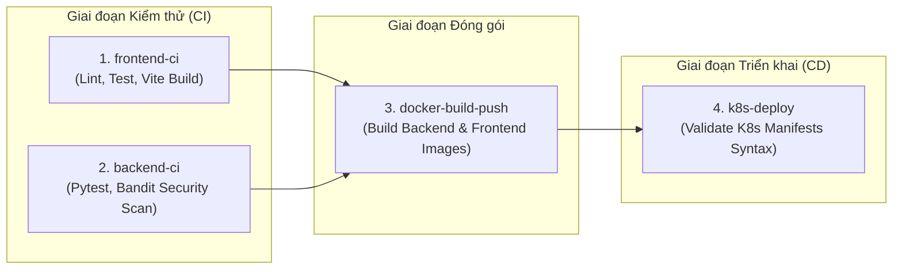
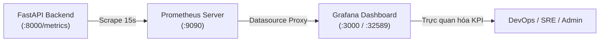

# 🛒 Enterprise Premium E-Commerce Platform

[](.github/workflows/ci-cd.yml)
[](https://fastapi.tiangolo.com)
[](https://www.python.org/)
[](https://react.dev/)
[](https://www.typescriptlang.org/)
[](https://www.postgresql.org/)
[](https://redis.io/)
[](https://www.pgbouncer.org/)
[](https://arq-docs.helpmanual.io/)
[](https://kubernetes.io/)
[](https://prometheus.io/)
[](https://grafana.com/)
[](https://tailscale.com/)
[](https://www.docker.com/)
[](LICENSE)

---

## 📌 Mục lục (Table of Contents)

- [📖 1. Tổng quan hệ thống (System Overview)](#-1-tổng-quan-hệ-thống-system-overview)
- [🏛️ 2. Kiến trúc hệ thống (System Architecture)](#️-2-kiến-trúc-hệ-thống-system-architecture)
  - [Sơ đồ luồng dữ liệu & hạ tầng Cloud-Native](#sơ-đồ-luồng-dữ-liệu--hạ-tầng-cloud-native)
  - [Thiết kế kỹ thuật cốt lõi (Core Technical Highlights)](#thiết-kế-kỹ-thuật-cốt-lõi-core-technical-highlights)
- [🚀 3. Công nghệ sử dụng (Tech Stack)](#-3-công-nghệ-sử-dụng-tech-stack)
- [📂 4. Cấu trúc thư mục (Directory Structure)](#-4-cấu-trúc-thư-mục-directory-structure)
- [✨ 5. Các phân hệ chức năng (Features & Modules)](#-5-các-phân-hệ-chức-năng-features--modules)
  - [Phân hệ Cửa hàng & Khách hàng (Storefront)](#phân-hệ-cửa-hàng--khách-hàng-storefront)
  - [Phân hệ Giỏ hàng & Thanh toán (Cart & Checkout Flow)](#phân-hệ-giỏ-hàng--thanh-toán-cart--checkout-flow)
  - [Cổng thanh toán VietQR / PayOS chuẩn NAPAS 247](#cổng-thanh-toán-vietqr--payos-chuẩn-napas-247)
  - [Hệ thống đánh giá sản phẩm có xác thực (Verified Buyer Reviews)](#hệ-thống-đánh-giá-sản-phẩm-có-xác-thực-verified-buyer-reviews)
  - [Xác thực & Phân quyền bảo mật (Auth & RBAC)](#xác-thực--phân-quyền-bảo-mật-auth--rbac)
  - [Hàng đợi tác vụ ngầm & Worker (Enterprise ARQ Background Worker)](#hàng-đợi-tác-vụ-ngầm--worker-enterprise-arq-background-worker)
  - [Cổng quản trị Admin & Quản lý (Admin Portal - 9 Tabs)](#cổng-quản-trị-admin--quản-lý-admin-portal---9-tabs)
  - [Sao lưu & Phục hồi cơ sở dữ liệu (Database Backup & Restore)](#sao-lưu--phục-hồi-cơ-sở-dữ-liệu-database-backup--restore)
- [🔑 6. Tài khoản mẫu & Dữ liệu khởi tạo (Default Accounts & Seed Data)](#-6-tài-khoản-mẫu--dữ-liệu-khởi-tạo-default-accounts--seed-data)
- [⚙️ 7. Cấu hình biến môi trường (Environment Variables)](#️-7-cấu-hình-biến-môi-trường-environment-variables)
- [📦 8. Hướng dẫn cài đặt và Khởi chạy (Quick Start & Deployment)](#-8-hướng-dẫn-cài-đặt-và-khởi-chạy-quick-start--deployment)
  - [Chuẩn bị môi trường (Prerequisites)](#chuẩn-bị-môi-trường-prerequisites)
  - [Cách 1: Khởi chạy bằng Docker Compose (Khuyên dùng cho Dev)](#cách-1-khởi-chạy-bằng-docker-compose-khuyên-dùng-cho-dev)
  - [Cách 2: Triển khai trên Kubernetes (Minikube / Kind / Production)](#cách-2-triển-khai-trên-kubernetes-minikube--kind--production)
  - [Cập nhật nóng hệ thống trên Kubernetes (Hot Updates)](#cập-nhật-nóng-hệ-thống-trên-kubernetes-hot-updates)
  - [🌐 Tích hợp Tailscale truy cập từ xa (Remote Access)](#-tích-hợp-tailscale-truy-cập-từ-xa-remote-access)
- [🗄️ 9. Quản trị Cơ sở dữ liệu & Caching (Database & Cache Ops)](#️-9-quản-trị-cơ-sở-dữ-liệu--caching-database--cache-ops)
  - [Alembic Migrations](#alembic-migrations)
  - [Seed Dữ liệu & CLI Quản trị viên](#seed-dữ-liệu--cli-quản-trị-viên)
  - [Quản lý Redis Cache & Xử lý Cache Stale](#quản-lý-redis-cache--xử-lý-cache-stale)
  - [Backup & Restore Cơ sở dữ liệu](#backup--restore-cơ-sở-dữ-liệu)
- [🔌 10. Danh mục API Endpoints (API Reference)](#-10-danh-mục-api-endpoints-api-reference)
- [🧪 11. Kiểm thử & Đảm bảo chất lượng (Testing & Quality Assurance)](#-11-kiểm-thử--đảm-bảo-chất-lượng-testing--quality-assurance)
- [🔄 12. Quy trình CI/CD Pipeline (GitHub Actions)](#-12-quy-trình-cicd-pipeline-github-actions)
- [📊 13. Giám sát & Vận hành (Monitoring & Observability)](#-13-giám-sát--vận-hành-monitoring--observability)
  - [1. Kiến trúc luồng giám sát (Monitoring Flow)](#1-kiến-trúc-luồng-giám-sát-monitoring-flow)
  - [2. Bảng điều khiển Grafana (Grafana Dashboard)](#2-bảng-điều-khiển-grafana-grafana-dashboard)
  - [3. Hướng dẫn sử dụng & Đăng nhập](#3-hướng-dẫn-sử-dụng--đăng-nhập)
  - [4. Kiểm thử tải (Benchmark) & Kubernetes Auto-Scaling (HPA)](#4-kiểm-thử-tải-benchmark--kubernetes-auto-scaling-hpa)
- [🛠️ 14. Khắc phục sự cố thường gặp (Troubleshooting & FAQs)](#️-14-khắc-phục-sự-cố-thường-gặp-troubleshooting--faqs)
- [🗺️ 15. Lộ trình phát triển tương lai (Development Roadmap)](ROADMAP.md)
- [📜 16. Giấy phép & Đóng góp (License & Contributing)](#-16-giấy-phép--đóng-góp-license--contributing)

---

## 📖 1. Tổng quan hệ thống (System Overview)

**Enterprise Premium E-Commerce Platform** là giải pháp thương mại điện tử cấp độ doanh nghiệp (Enterprise Grade) toàn diện. Dự án mô phỏng quy trình tiêu chuẩn công nghiệp hiện đại: từ phân tích bài toán nghiệp vụ, thiết kế kiến trúc phân tán (Microservices/SOA), lập trình ứng dụng bất đồng bộ (Asynchronous I/O), xử lý giao dịch chịu tải cao (High Concurrency & ACID Integrity), đến kiểm thử tự động (Unit/Integration Testing, Security Scan) và tự động hóa vận hành trên nền tảng Cloud-Native Kubernetes & Docker.

### Điểm nổi bật:
- ⚡ **Tốc độ & Hiệu năng cao**: Backend FastAPI bất đồng bộ (`async`/`await`) kết hợp với Connection Pooler PgBouncer và Redis In-Memory Cache giảm thiểu độ trễ truy vấn (sub-millisecond latency).
- 🛡️ **Bảo mật & Toàn vẹn dữ liệu**: Mã hóa mật khẩu chuẩn Argon2, xác thực JWT kèm cơ chế **Token Family Rotation** chống tấn công phát lại (Replay Attacks), lọc log nhạy cảm tự động (Sensitive Data Redaction), phân quyền theo vai trò (RBAC: Customer, Manager, Admin).
- 🔒 **Kiểm soát đồng thời (Concurrency Control)**: Ngăn chặn triệt để tình trạng bán vượt số lượng tồn kho (Overselling) và Deadlock trong thanh toán bằng cơ chế **Pessimistic Locking** (`SELECT ... FOR UPDATE`) có sắp xếp thứ tự và trường `version` hỗ trợ Optimistic Locking.
- ⚙️ **Hàng đợi tác vụ ngầm (Enterprise ARQ Background Worker)**: Tách biệt hoàn toàn các tác vụ nặng (xuất báo cáo Excel/CSV, tối ưu nén ảnh WebP, gửi email giao dịch Jinja2) khỏi luồng API chính thông qua Redis Queue.
- 💳 **Thanh toán VietQR / PayOS chuẩn NAPAS 247**: Tích hợp thanh toán QR Code động, tự động nhận diện nội dung chuyển khoản và Webhook đồng bộ trạng thái an toàn với chữ ký HMAC SHA256.
- 📈 **Tự động co giãn đàn hồi (Kubernetes HPA)**: Giám sát tài nguyên CPU chu kỳ thực và tự động mở rộng Backend từ **3 Pods lên 6-8 Pods** khi gặp tải cao điểm, tự động thu nhỏ khi hết tải.
- 🌐 **Mạng riêng ảo an toàn Tailscale WireGuard**: Tích hợp sẵn tính năng chia sẻ an toàn từ xa cho Storefront và Grafana qua `tailscale serve` mà không cần NAT/mở cổng public router.
- 📊 **Giám sát toàn diện Cloud-Native**: Tích hợp sẵn Prometheus exporter tại `/metrics` và Grafana v11 Dashboard tự động nạp (Auto-Provisioning) theo dõi Throughput, Latency đa phân vị (P50/P90/P95/P99) và tài nguyên hệ thống.

---

## 🏛️ 2. Kiến trúc hệ thống (System Architecture)

### Sơ đồ luồng dữ liệu & hạ tầng Cloud-Native

```mermaid
flowchart TB
    subgraph Clients["Lớp Khách hàng (Client Layer)"]
        WebBrowser["Web Browser (SPA React 18 + Vite)"]
        MobileApp["Mobile / Thiết bị qua Tailscale WireGuard"]
    end

    subgraph GatewayLayer["Lớp Gateway & Điều phối (Ingress / Proxy)"]
        Ingress["Nginx Ingress Controller / Reverse Proxy (:80)\n- Điều phối /api -> Backend\n- Phục vụ / -> Frontend\n- Static files -> /media"]
    end

    subgraph FrontendCluster["Lớp Giao diện (Frontend Deployment)"]
        FE1["Frontend Pod 1 (Nginx Alpine)"]
        FE2["Frontend Pod 2 (Nginx Alpine)"]
    end

    subgraph BackendCluster["Lớp Ứng dụng Backend (FastAPI + Gunicorn)"]
        HPA["Kubernetes HPA\n(Target: CPU > 50% | Min: 3 | Max: 8)"]
        BE1["Backend Pod 1 (5 Workers)"]
        BE2["Backend Pod 2 (5 Workers)"]
        BE3["Backend Pod 3 (5 Workers)"]
        HPA -.->|Scale out/in| BackendCluster
    end

    subgraph WorkerLayer["Lớp Tác vụ ngầm (Enterprise ARQ Worker)"]
        WorkerPod["Worker Pod (Deployment / ARQ)\n- Send Email Tasks (Jinja2)\n- Image Optimization (WebP)\n- Sales Reports Export (Excel/CSV)"]
    end

    subgraph CachingLayer["Lớp Bộ đệm & Hàng đợi (Redis 7 StatefulSet)"]
        Redis[("Redis 7 (:6379)\n- Session & Carts Cache\n- Product Query Cache (TTL 300s)\n- Token Family Blacklist\n- ARQ Job Queue")]
    end

    subgraph DatabaseLayer["Lớp Lưu trữ Cơ sở dữ liệu (PostgreSQL 16)"]
        PgBouncer["PgBouncer Pooler (:6432)\nTransaction Mode (max 100 conns)"]
        Postgres[("PostgreSQL 16 StatefulSet (:5432)\n- PersistentVolume 10Gi\n- UUIDv7 Primary Keys\n- Partial Unique Indexes")]
    end

    subgraph MonitoringLayer["Lớp Giám sát & Cảnh báo (Prometheus + Grafana)"]
        MS["Metrics-Server (K8s Addon)"]
        Prom["Prometheus (:9090)\nScrape /metrics 15s"]
        Graf["Grafana Dashboard (:3000 / :32589)\nAuto-Provisioned KPI Dashboard"]
    end

    subgraph AutomationJobs["Tác vụ tự động hóa Kubernetes"]
        MigJob["db-migration-job\n(Alembic Upgrade Head - Pre-deploy)"]
        BackupCron["postgres-daily-backup\n(CronJob: 02:00 UTC, 7-day retention)"]
        CleanerJob["image-cleaner\n(Dọn dẹp image cũ)"]
        PVCBackups[("postgres-backups-pvc (5Gi)")]
    end

    %% Client Routing
    WebBrowser --> Ingress
    MobileApp --> Ingress
    Ingress -- "Route /" --> FrontendCluster
    Ingress -- "Route /api/*" --> BackendCluster

    %% Backend connections
    BackendCluster --> Redis
    BackendCluster --> PgBouncer
    PgBouncer --> Postgres

    %% Worker connections
    WorkerPod --> Redis
    WorkerPod --> Postgres

    %% Monitoring connections
    MS --> BackendCluster
    HPA --> MS
    Prom --> BackendCluster
    Graf --> Prom

    %% Automation
    MigJob -. "Direct :5432" .-> Postgres
    BackupCron -. "pg_dump" .-> Postgres
    BackupCron -. "Store .dump" .-> PVCBackups
```

---

### Thiết kế kỹ thuật cốt lõi (Core Technical Highlights)

1. **Khóa chính thời gian thực UUIDv7 (Time-Ordered Primary Keys)**:
   - Tất cả các bảng cơ sở dữ liệu (`User`, `Product`, `Category`, `Brand`, `Order`, `OrderItem`, `Address`, `Voucher`, `Payment`, `PaymentTransaction`, `Review`) sử dụng chuẩn **UUIDv7**.
   - Khắc phục hiện tượng phân mảnh chỉ mục (B-Tree fragmentation) của UUIDv4 ngẫu nhiên truyền thống, tăng tốc độ ghi dữ liệu lớn đồng thời không để lộ cấu trúc ID tuần tự tự tăng.
2. **Kiểm soát giao dịch & Khóa dòng chống quá bán (Pessimistic Locking)**:
   - Trong quá trình tạo đơn hàng (`create_order_with_transaction`), hệ thống sắp xếp danh sách sản phẩm theo ID rồi thực thi `SELECT ... FOR UPDATE` trong transaction của PostgreSQL.
   - Cơ chế này loại bỏ hoàn toàn nguy cơ Deadlock giữa các giao dịch đồng thời và đảm bảo trừ kho an toàn tuyệt đối. Model `Product` lưu kèm thuộc tính `version` hỗ trợ Optimistic Locking.
3. **Cơ chế Token Family Rotation & Chống Replay Attacks**:
   - Triển khai theo khuyến nghị RFC OAuth2 Security Best Current Practice. Mỗi chu kỳ đăng nhập khởi tạo một `family_id` trong Redis.
   - Khi Client đổi Refresh Token lấy Access Token mới, Token cũ được cấp thời gian ân hạn 30 giây (Grace Period). Nếu phát hiện Refresh Token cũ bị sử dụng lại sau ân hạn, hệ thống lập tức thu hồi toàn bộ Family (`revoked_family`), vô hiệu hóa phiên làm việc ngay lập tức.
4. **Hàng đợi tác vụ ngầm Enterprise ARQ Worker**:
   - Sử dụng thư viện `arq` bất đồng bộ trên nền Redis.
   - Tách biệt các tác vụ tốn thời gian: xuất báo cáo bán hàng/doanh thu ra định dạng Excel (`.xlsx`)/CSV, nén và chuyển đổi ảnh sản phẩm sang chuẩn WebP, gửi email thông báo đơn hàng và kích hoạt tài khoản.
   - Có endpoint theo dõi tiến độ (`/api/v1/jobs/status/{job_id}`) và giao diện đồ họa quản lý hàng đợi trên trang Admin.
5. **Cổng thanh toán VietQR / PayOS chuẩn NAPAS 247**:
   - Sinh mã VietQR động theo từng đơn hàng với nội dung chuyển khoản tự động `DH{order_code}`.
   - Cơ chế xác thực chữ ký Webhook HMAC SHA256 bảo vệ giao dịch không bị giả mạo.
6. **Xóa mềm với chỉ mục duy nhất có điều kiện (Partial Unique Index)**:
   - Các bảng kế thừa `deleted_at`. Bảng `User` đảm bảo tính duy nhất của `email` và `username` thông qua PostgreSQL Partial Index:
     ```sql
     CREATE UNIQUE INDEX ix_users_email_unique ON users (email) WHERE deleted_at IS NULL;
     CREATE UNIQUE INDEX ix_users_username_unique ON users (username) WHERE deleted_at IS NULL;
     ```
7. **Lọc thông tin nhạy cảm trong Log (Sensitive Data Redaction)**:
   - Áp dụng `RedactingFormatter` cho Python Logger. Toàn bộ chuỗi chứa mật khẩu (`"password"`), mã xác thực (`"token"`), hoặc thẻ ngân hàng (`"credit_card"`) đều tự động được mask thành `***REDACTED***` trước khi xuất ra STDOUT.
8. **Pooler kết nối cơ sở dữ liệu (PgBouncer in Transaction Mode)**:
   - Backend kết nối qua PgBouncer tại cổng `6432` với chế độ `transaction`. Các tác vụ migration schema (Alembic) sẽ kết nối trực tiếp đến PostgreSQL tại cổng `5432` để đảm bảo thực thi đầy đủ các câu lệnh DDL.
9. **Tự động co giãn theo tải (Kubernetes HPA & Metrics-Server)**:
   - Thiết lập Kubernetes Horizontal Pod Autoscaler (`k8s/hpa.yaml`) theo dõi mức CPU tiêu thụ trung bình. Khi tải đồng thời tăng cao khiến CPU vượt ngưỡng 50%, K8s tự động nhân đôi số lượng Pods từ **3 lên 6-8 Pods** và tự động thu nhỏ về 3 Pods sau khi hết tải.

---

## 🚀 3. Công nghệ sử dụng (Tech Stack)

| Phân hệ | Công nghệ / Thư viện | Phiên bản | Vai trò & Mục đích sử dụng |
| :--- | :--- | :--- | :--- |
| **Backend Framework** | [FastAPI](https://fastapi.tiangolo.com/) | `>=0.111.0` | Framework web bất đồng bộ hiệu năng cao, tự động sinh tài liệu Swagger/OpenAPI |
| **ASGI / WSGI Server**| [Uvicorn](https://www.uvicorn.org/) + [Gunicorn](https://gunicorn.org/) | `0.30+` / `22.0+` | Quản lý worker đa tiến trình (`UvicornWorker`), scale theo số nhân CPU |
| **Data Validation**   | [Pydantic](https://docs.pydantic.dev/) & Pydantic-Settings | `>=2.7.0` | Kiểm tra dữ liệu đầu vào/ra nghiêm ngặt, đọc cấu hình môi trường |
| **ORM & Database**    | [SQLAlchemy 2.0](https://www.sqlalchemy.org/) + [asyncpg](https://github.com/MagicStack/asyncpg) | `2.0.30` / `0.29.0` | Async ORM hiện đại, kết nối PostgreSQL bất đồng bộ thuần binary protocol |
| **Schema Migration**  | [Alembic](https://alembic.sqlalchemy.org/) | `>=1.13.1` | Quản lý phiên bản cấu trúc cơ sở dữ liệu (Database Migrations) |
| **Caching & Queue**   | [Redis](https://redis.io/) (via `redis.asyncio`) | `7-alpine` / `>=5.0.4` | Caching sản phẩm, giỏ hàng, Token Family, và làm Message Broker cho Worker |
| **Background Worker** | [ARQ](https://arq-docs.helpmanual.io/) | `>=0.25.0` | Hàng đợi tác vụ ngầm bất đồng bộ (Email, tối ưu ảnh WebP, xuất báo cáo) |
| **Connection Pool**   | [PgBouncer](https://www.pgbouncer.org/) | `latest` (edoburu) | Transaction-level connection pooling tối ưu tải kết nối cơ sở dữ liệu |
| **Database Engine**   | [PostgreSQL](https://www.postgresql.org/) | `16-alpine` | Cơ sở dữ liệu quan hệ chính, lưu trữ bền vững với ACID tuyệt đối |
| **Security & Auth**   | [Passlib](https://passlib.readthedocs.io/) (Argon2) + [PyJWT](https://pyjwt.readthedocs.io/) | `1.7.4` / `2.8.0` | Hashing mật khẩu chuẩn Argon2id, ký và giải mã JWT token |
| **Image Optimization**| [Pillow](https://python-pillow.org/) | `>=10.3.0` | Xử lý ảnh sản phẩm, nén và chuyển đổi WebP, resize thumbnail |
| **Excel & Report**    | [XlsxWriter](https://xlsxwriter.readthedocs.io/) + [Pandas](https://pandas.pydata.org/) | `>=3.2.0` / `>=2.2.0` | Xuất báo cáo tài chính, doanh thu bán hàng ra định dạng Excel / CSV |
| **Email Templating**  | [Jinja2](https://jinja.palletsprojects.com/) | `>=3.1.4` | Render mẫu email HTML động (hóa đơn đơn hàng, email kích hoạt, reset mật khẩu) |
| **Payment Gateway**   | VietQR / PayOS SDK | Chuẩn NAPAS 247 | Tạo mã QR thanh toán động và xác thực Webhook HMAC SHA256 |
| **UUID Generator**    | [uuid6](https://github.com/oittaa/uuid6-python) | `>=2024.1.12` | Sinh UUIDv7 có sắp xếp thời gian (time-ordered) |
| **Frontend Framework**| [React](https://react.dev/) + [Vite](https://vitejs.dev/) | `18.2` / `4.4+` | Thư viện giao diện SPA hiện đại, build tool tốc độ cao |
| **Language (FE)**     | [TypeScript](https://www.typescriptlang.org/) | `>=5.0.2` | Đảm bảo tính nhất quán của kiểu dữ liệu toàn bộ ứng dụng |
| **Routing (FE)**      | [Wouter](https://github.com/molefrog/wouter) | `^3.10.0` | Thư viện routing siêu nhẹ (~1.5KB), tối ưu kích thước bundle |
| **State Management**  | [Zustand](https://github.com/pmndrs/zustand) | `^5.0.15` | Global state management nhẹ nhàng, linh hoạt, hiệu năng cao |
| **Styling & UI**      | [TailwindCSS](https://tailwindcss.com/) + [Motion](https://motion.dev/) | `3.3.3` / `13.1+` | Utility-first CSS, chuyển động mượt mà (Framer Motion) |
| **Components & Icons**| [Phosphor Icons](https://phosphoricons.com/) + [Sonner](https://sonner.emilkowal.ski/) | `2.1+` / `1.5+` | Bộ icon cao cấp và hệ thống Toast notification tinh tế |
| **Containerization**  | [Docker](https://www.docker.com/) & Docker Compose | Multi-stage | Đóng gói môi trường đồng nhất giữa Dev và Production |
| **Orchestration**    | [Kubernetes](https://kubernetes.io/) (K8s) | `v1.28+` | Quản trị cụm Pods, tự động phục hồi (Self-healing), rolling updates, HPA |
| **Auto-Scaling**      | Kubernetes HPA + Metrics-Server | v2 | Tự động co giãn số lượng Pod backend theo ngưỡng tải CPU thực tế |
| **Ingress & Proxy**   | [Nginx](https://nginx.org/) | `alpine` | Cân bằng tải, reverse proxy, phục vụ file tĩnh và nén Gzip |
| **Mesh VPN Gateway**  | [Tailscale](https://tailscale.com/) | Latest | Mạng riêng ảo WireGuard chia sẻ quyền truy cập an toàn từ xa |
| **Testing Backend**   | [Pytest](https://docs.pytest.org/) + `pytest-asyncio` + `pytest-cov` | `8.2+` | Kiểm thử tự động Async API, đo lường độ phủ code |
| **Testing Frontend**  | [Vitest](https://vitest.dev/) + React Testing Library + JSDOM | `4.1+` | Kiểm thử Component, Custom Hooks và Store |
| **Load Testing**      | [ApacheBench (`ab`)](https://httpd.apache.org/docs/2.4/programs/ab.html) | `2.3` | Kiểm thử hiệu năng chịu tải đồng thời cao và kiểm chứng HPA |
| **Security Scanner**  | [Bandit](https://github.com/PyCQA/bandit) | Latest | Quét tĩnh mã nguồn Python phát hiện các lỗ hổng bảo mật phổ biến |
| **CI/CD**             | [GitHub Actions](https://github.com/features/actions) | v4/v5 | Tự động hóa kiểm thử, build Docker images, validate K8s manifests |
| **Monitoring**        | [Prometheus](https://prometheus.io/) + [Grafana](https://grafana.com/) | v2.53 / v11.1 | Thu thập metrics hiệu năng API và trực quan hóa dashboard |

---

## 📂 4. Cấu trúc thư mục (Directory Structure)

```plaintext
ecommerce/
├── .github/
│   └── workflows/
│       └── ci-cd.yml                # Pipeline CI/CD tự động (Lint, Test, Build, K8s Validate)
├── backend/
│   ├── alembic/
│   │   ├── env.py                   # Cấu hình môi trường Async migration cho Alembic
│   │   └── versions/                # Lịch sử các file migration database
│   ├── app/
│   │   ├── api/
│   │   │   ├── deps.py              # Dependencies: get_current_user, get_current_admin, get_current_staff
│   │   │   └── v1/endpoints/
│   │   │       ├── addresses.py     # API quản lý sổ địa chỉ giao hàng
│   │   │       ├── async_jobs.py    # API kích hoạt xuất báo cáo, tối ưu ảnh, gửi email qua Worker
│   │   │       ├── auth.py          # API đăng ký, đăng nhập, đổi token, thông tin me
│   │   │       ├── backup.py        # API quản trị sao lưu & phục hồi cơ sở dữ liệu
│   │   │       ├── brands.py        # API quản lý thương hiệu
│   │   │       ├── cart.py          # API giỏ hàng người dùng (Redis Cache)
│   │   │       ├── categories.py    # API quản lý danh mục sản phẩm
│   │   │       ├── checkout.py      # API thanh toán tổng hợp
│   │   │       ├── orders.py        # API đặt hàng, hủy đơn, danh sách đơn (Pessimistic Lock)
│   │   │       ├── payments.py      # API VietQR / PayOS & xác thực chữ ký Webhook HMAC
│   │   │       ├── products.py      # API xem sản phẩm, bộ lọc đa chiều, quản trị CRUD
│   │   │       ├── reviews.py       # API đánh giá sản phẩm có xác thực người mua (Verified Buyer)
│   │   │       ├── users.py         # API quản trị tài khoản người dùng & phân quyền
│   │   │       └── vouchers.py      # API mã giảm giá, kiểm tra tính hợp lệ
│   │   ├── core/
│   │   │   ├── config.py            # Cấu hình Pydantic BaseSettings đọc biến môi trường
│   │   │   ├── db.py                # Khởi tạo Async Engine, SessionFactory
│   │   │   ├── logging.py           # Custom RedactingFormatter che dấu thông tin nhạy cảm
│   │   │   ├── queue.py             # ARQ Redis queue pool & task enqueue dispatchers
│   │   │   ├── redis.py             # Khởi tạo kết nối Redis async connection pool
│   │   │   ├── security.py          # Xử lý Argon2 password hashing & JWT token encode/decode
│   │   │   ├── security_crypto.py   # HMAC SHA256 chữ ký số cho cổng thanh toán
│   │   │   └── utils.py             # Hàm sinh UUIDv7
│   │   ├── crud/                    # Data Access Layer (Repository Pattern)
│   │   │   ├── brand.py             # CRUD Brand
│   │   │   ├── order.py             # CRUD Order với Pessimistic Lock & Stock check
│   │   │   ├── product.py           # CRUD Product với SELECT FOR UPDATE
│   │   │   ├── review.py            # CRUD Review & rating summary
│   │   │   ├── user.py              # CRUD User
│   │   │   └── voucher.py           # CRUD Voucher & điều kiện áp dụng
│   │   ├── models/                  # SQLAlchemy Declarative Models (UUIDv7, Soft-delete)
│   │   │   ├── address.py           # Model Address
│   │   │   ├── base.py              # Base Model (created_at, updated_at, deleted_at)
│   │   │   ├── brand.py             # Model Brand
│   │   │   ├── order.py             # Model Order, OrderItem, Payment
│   │   │   ├── payment_transaction.py # Model PaymentTransaction (lịch sử giao dịch VietQR)
│   │   │   ├── product.py           # Model Product, Category (có version lock)
│   │   │   ├── review.py            # Model Review (Verified Purchase)
│   │   │   ├── user.py              # Model User (Partial Unique Index)
│   │   │   └── voucher.py           # Model Voucher
│   │   ├── schemas/                 # Pydantic Schemas (Request/Response DTOs)
│   │   ├── services/                # Business Logic Services
│   │   │   ├── cart.py              # Giỏ hàng lưu trữ Redis
│   │   │   ├── email.py             # Dịch vụ gửi email HTML Jinja2 (SMTP/Mailjet/Sandbox)
│   │   │   ├── media.py             # Dịch vụ tối ưu ảnh, chuyển đổi WebP, resize thumbnail
│   │   │   ├── reports.py           # Dịch vụ xuất báo cáo bán hàng/doanh thu Excel/CSV
│   │   │   ├── token.py             # Token Family Rotation & Replay Attack Defense
│   │   │   └── user.py              # Logic nghiệp vụ người dùng
│   │   ├── worker.py                # Enterprise ARQ WorkerSettings & task handlers
│   │   └── main.py                  # Khởi tạo FastAPI App, Prometheus, Static /media, Routers
│   ├── tests/                       # Bộ kiểm thử tự động toàn diện
│   │   ├── api/                     # Test endpoints (Auth, Admin, Orders, Payments, Products, Reviews, Monitoring)
│   │   ├── core/                    # Test DB config, Security hashing, Log redaction
│   │   └── domain/                  # Test Models, UUIDv7, User Domain Service
│   ├── alembic.ini                  # File cấu hình Alembic
│   ├── bandit.yaml                  # Cấu hình quét mã độc / lỗ hổng bảo mật Bandit
│   ├── create_admin.py              # CLI tạo tài khoản Admin tối cao
│   ├── create_staff.py              # CLI tạo tài khoản Staff (Manager / Admin)
│   ├── seed_db.py                   # Script khởi tạo 100+ sản phẩm, danh mục, thương hiệu, vouchers, demo users
│   ├── entrypoint.sh                # Container entrypoint: phân luồng web gunicorn vs arq worker
│   ├── Dockerfile                   # Dockerfile Backend đa tầng tối ưu dung lượng
│   └── requirements.txt             # Danh mục thư viện Python
├── frontend/
│   ├── src/
│   │   ├── components/
│   │   │   ├── layout/              # Navbar (Floating), Footer
│   │   │   ├── payment/             # VietQRModal, PaymentStatusPolling
│   │   │   ├── profile/             # AddressModal, OrderHistory, InfoCard
│   │   │   ├── reviews/             # ProductReviewSection, ReviewForm, StarRating
│   │   │   ├── sections/            # Hero, FeaturedProducts, Categories, Brands
│   │   │   └── ui/                  # Button, Input, Modal, Badge, Card
│   │   ├── pages/
│   │   │   ├── admin/               # 9 Phân hệ Quản trị viên chuyên sâu
│   │   │   │   ├── AdminOverview.tsx     # Tab 1: Tổng quan chỉ số KPI, biểu đồ doanh thu
│   │   │   │   ├── AdminProducts.tsx     # Tab 2: Quản lý sản phẩm, giá, tồn kho
│   │   │   │   ├── AdminBrands.tsx       # Tab 3: Quản lý thương hiệu
│   │   │   │   ├── AdminCategories.tsx   # Tab 4: Quản lý danh mục sản phẩm
│   │   │   │   ├── AdminOrders.tsx       # Tab 5: Quản lý và xử lý đơn hàng
│   │   │   │   ├── AdminUsers.tsx        # Tab 6: Quản lý người dùng và vai trò RBAC
│   │   │   │   ├── AdminVouchers.tsx     # Tab 7: Cấu hình mã khuyến mãi
│   │   │   │   ├── AdminBackups.tsx      # Tab 8: Sao lưu & Khôi phục dữ liệu Database
│   │   │   │   └── AdminAsyncJobs.tsx    # Tab 9: Giám sát Redis Queue, xuất báo cáo, nén ảnh
│   │   │   ├── Admin.tsx            # Trang Quản trị viên chính điều hướng 9 Tabs
│   │   │   ├── Cart.tsx             # Trang Giỏ hàng
│   │   │   ├── Checkout.tsx         # Trang Thanh toán chọn địa chỉ, áp voucher, phương thức trả
│   │   │   ├── Login.tsx            # Trang Đăng nhập
│   │   │   ├── PaymentResult.tsx    # Trang Thông báo kết quả thanh toán & đơn hàng
│   │   │   ├── ProductDetail.tsx    # Trang Chi tiết sản phẩm, đánh giá sao & thêm vào giỏ
│   │   │   ├── ProductsPage.tsx     # Trang Danh sách sản phẩm với bộ lọc đa chiều & tìm kiếm
│   │   │   ├── Profile.tsx          # Trang Hồ sơ cá nhân, đổi thông tin, sổ địa chỉ, lịch sử đơn
│   │   │   ├── Register.tsx         # Trang Đăng ký người dùng
│   │   │   └── Storefront.tsx       # Trang chủ Trang trọng (Landing page)
│   │   ├── store/                   # Zustand Stores (useAuthStore, useCartStore, useProductStore)
│   │   ├── App.tsx                  # Khởi tạo App & Wouter Route Switch
│   │   └── main.tsx                 # Entrypoint React 18 DOM
│   ├── nginx.conf                   # Cấu hình Nginx phục vụ SPA & Proxy API ngược về Backend
│   ├── Dockerfile                   # Dockerfile Frontend Multi-Stage Build (Node 20 -> Nginx Alpine)
│   ├── package.json                 # Danh mục thư viện và scripts Frontend
│   └── vitest.config.ts             # Cấu hình Vitest runner
├── k8s/                             # Toàn bộ Manifests triển khai Kubernetes
│   ├── addons/
│   │   └── tailscale.yaml           # Deployment Tailscale Pod cho cụm K8s
│   ├── backend.yaml                 # Deployment Backend (3 Replicas) + Service ClusterIP
│   ├── cleaner.yaml                 # Job dọn dẹp image cũ khỏi node containerd
│   ├── frontend.yaml                # Deployment Frontend (2 Replicas) + Service LoadBalancer
│   ├── hpa.yaml                     # HorizontalPodAutoscaler (Target CPU: 50%, Min: 3, Max: 8)
│   ├── ingress.yaml                 # Ingress routing `/api` -> backend và `/` -> frontend
│   ├── migration-job.yaml           # Job tự động chạy Alembic upgrade head trước khi mở traffic
│   ├── monitoring.yaml              # Prometheus & Grafana Deployments, Services, ConfigMaps
│   ├── pgbouncer.yaml               # Deployment PgBouncer (2 Replicas) + Service PgBouncer
│   ├── postgres.yaml                # StatefulSet PostgreSQL + Headless Service + PVC 10Gi
│   ├── postgres-backup.yaml         # PersistentVolumeClaim 5Gi + CronJob sao lưu hàng ngày lúc 02:00 UTC
│   ├── redis.yaml                   # StatefulSet Redis + Service + PVC 2Gi
│   └── worker.yaml                  # Deployment Enterprise ARQ Background Worker (1 Replica)
├── monitoring/
│   ├── grafana/
│   │   └── provisioning/            # Cấu hình tự động nạp Datasource và Dashboard cho Grafana
│   │       ├── dashboards/
│   │       └── datasources/
│   ├── grafana-dashboard.json       # Bảng điều khiển Grafana v11 hoàn chỉnh (KPIs, RPS, Latency, CPU/RAM)
│   └── prometheus.yml               # Cấu hình Scraper Prometheus cào `/metrics` chu kỳ 15s
├── nginx/
│   └── conf.d/default.conf          # Cấu hình Reverse Proxy Nginx cho môi trường Docker Compose
├── pgbouncer/
│   └── pgbouncer.ini                # Cấu hình Transaction Pool, Port 6432, Scram-sha-256
├── tailscale/
│   └── serve.json                   # Cấu hình chuyển tiếp cổng Tailscale Serve (80 -> FE, 3000 -> Grafana)
├── scripts/                         # Bộ công cụ tự động hóa toàn diện
│   ├── backup-restore/
│   │   ├── backup-db.sh             # Script sao lưu database thủ công (hỗ trợ cả K8s và Docker)
│   │   └── restore-db.sh            # Script phục hồi database từ file .dump
│   ├── benchmark/
│   │   └── benchmark.sh             # Script kiểm thử tải ApacheBench (ab) & theo dõi HPA
│   ├── linux/
│   │   ├── docker/
│   │   │   ├── start-docker-linux.sh     # Khởi chạy Docker Compose (Linux)
│   │   │   ├── start-docker-tailscale.sh # Khởi chạy Docker Compose kèm Tailscale
│   │   │   └── stop-docker.sh            # Dừng và gỡ bỏ Docker Compose (Linux)
│   │   ├── k8s/
│   │   │   ├── start-k8s-linux.sh        # Tự động hóa triển khai Kubernetes thông minh cho Linux
│   │   │   └── stop-k8s.sh               # Gỡ bỏ toàn bộ tài nguyên Kubernetes (Linux)
│   │   ├── tailscale/
│   │   │   ├── expose-tailscale.sh       # Bật chia sẻ mạng riêng ảo Tailscale
│   │   │   └── stop-tailscale.sh         # Dừng chia sẻ Tailscale
│   │   ├── status.sh                     # Kiểm tra trạng thái sức khỏe hệ thống (Docker & K8s)
│   │   ├── update-k8s-backend.sh         # Cập nhật nóng Backend image lên Kubernetes
│   │   └── update-k8s-frontend.sh        # Cập nhật nóng Frontend image lên Kubernetes
│   └── windows/
│       ├── docker/
│       │   ├── start-docker-windows.bat  # Khởi chạy Docker Compose (Windows)
│       │   ├── start-docker-tailscale.bat# Khởi chạy Docker Compose kèm Tailscale
│       │   └── stop-docker.bat           # Dừng Docker Compose (Windows)
│       ├── k8s/
│       │   ├── start-k8s-windows.bat     # Triển khai Kubernetes (Windows)
│       │   └── stop-k8s.bat              # Gỡ bỏ tài nguyên Kubernetes (Windows)
│       ├── tailscale/
│       │   ├── expose-tailscale.bat      # Bật chia sẻ Tailscale (Windows)
│       │   └── stop-tailscale.bat        # Dừng chia sẻ Tailscale (Windows)
│       ├── status.bat                    # Kiểm tra trạng thái hệ thống (Windows)
│       ├── update-k8s-backend.bat        # Cập nhật nóng Backend image (Windows)
│       └── update-k8s-frontend.bat       # Cập nhật nóng Frontend image (Windows)
├── .env.example                     # File mẫu khai báo biến môi trường chuẩn
├── docker-compose.yml               # Cấu hình khởi chạy toàn bộ hệ thống bằng Docker Compose
├── BENCHMARK.md                     # Tài liệu chuyên sâu kiểm thử tải ApacheBench & Kubernetes HPA
├── K8S-TROUBLESHOOTING.md           # Sổ tay khắc phục các lỗi Kubernetes thực tế
├── REDIS-TROUBLESHOOTING.md         # Hướng dẫn chi tiết khắc phục lỗi Redis Cache Stale
└── ROADMAP.md                       # Bản đồ định hướng nâng cấp kiến trúc tương lai
```

---

## ✨ 5. Các phân hệ chức năng (Features & Modules)

### Phân hệ Cửa hàng & Khách hàng (Storefront)
- **Trang chủ (Storefront)**: Thiết kế giao diện hiện đại, sang trọng (Modern Luxury UI), Hero banner tương tác, danh mục thịnh hành, thương hiệu đối tác và cam kết chất lượng.
- **Danh mục & Bộ lọc sản phẩm (Catalog & Filtering)**:
  - Tìm kiếm tức thì theo từ khóa tên và mô tả sản phẩm.
  - Lọc theo Danh mục (Apparel, Footwear, Accessories, Home...).
  - Lọc theo Thương hiệu (Nike, Apple, Sony, Uniqlo, Acme...).
  - Lọc theo khoảng giá linh hoạt (Min Price - Max Price).
  - Sắp xếp sản phẩm đa tiêu chí: Mới nhất, Giá tăng dần, Giá giảm dần, Đánh giá cao nhất.
  - Phân trang bất đồng bộ (Pagination).
- **Chi tiết sản phẩm (Product Detail)**: Hình ảnh chất lượng cao kèm các biến thể WebP, mô tả thông số chi tiết, tình trạng tồn kho tức thời (In Stock / Out of Stock), đánh giá sao và thương hiệu liên quan.

### Phân hệ Giỏ hàng & Thanh toán (Cart & Checkout Flow)
- **Giỏ hàng lưu trữ Redis (In-Memory Cart)**:
  - Dữ liệu giỏ hàng được đồng bộ và lưu trữ trực tiếp trong Redis theo `user_id`, cho phép thêm, sửa số lượng, xóa từng món hoặc dọn sạch giỏ hàng với tốc độ phản hồi tính bằng mili-giây.
- **Sổ địa chỉ người dùng (Address Book)**:
  - Hỗ trợ lưu trữ nhiều địa chỉ nhận hàng chi tiết (Tỉnh/Thành, Quận/Huyện, Phường/Xã, Số nhà/Tên đường, Số điện thoại người nhận).
  - Cho phép thiết lập một địa chỉ làm địa chỉ mặc định (Default Address).
- **Áp dụng Mã giảm giá (Vouchers Engine)**:
  - Hỗ trợ 2 hình thức giảm giá: Giảm theo phần trăm (`PERCENTAGE`) và Giảm số tiền cố định (`FIXED`).
  - Tự động kiểm tra giá trị đơn hàng tối thiểu (`min_order_amount`), giới hạn số tiền giảm tối đa (`max_discount_amount`), hạn sử dụng và số lần sử dụng tối đa (`usage_limit`).
- **Xử lý đơn hàng an toàn (Atomic Order Processing)**:
  - Khóa dòng sản phẩm bằng **Pessimistic Locking** (`FOR UPDATE`) để trừ tồn kho an toàn trong cùng một transaction.
  - Hỗ trợ các phương thức thanh toán: COD (Tiền mặt khi nhận hàng), Chuyển khoản ngân hàng (Bank Transfer), và Cổng thanh toán VietQR / PayOS.

### Cổng thanh toán VietQR / PayOS chuẩn NAPAS 247
- **Mã QR động theo đơn hàng**: Tự động sinh mã VietQR chuẩn liên ngân hàng NAPAS 247 kèm số tiền chính xác và nội dung chuyển khoản tự động `DH{order_code}`.
- **Tự động thăm dò trạng thái (Auto-Polling)**: Giao diện Checkout tự động kiểm tra trạng thái thanh toán ngầm mỗi vài giây mà không cần người dùng tải lại trang.
- **Webhook bảo mật HMAC SHA256**: Xử lý Webhook callback tức thời từ PayOS, xác thực chữ ký số bằng khóa bí mật để xác nhận đơn hàng thành công ngay khi tiền vào tài khoản.

### Hệ thống đánh giá sản phẩm có xác thực (Verified Buyer Reviews)
- **Chống đánh giá giả mạo (Anti-Fraud Review Engine)**: Chỉ những người dùng đã đăng nhập, đã đặt mua sản phẩm đó và đơn hàng đã ở trạng thái Giao hàng thành công (`DELIVERED`) mới có quyền gửi đánh giá sao (1-5 sao) và nhận xét.
- **Tóm tắt đánh giá (Review Summary)**: Tự động tính toán điểm trung bình và biểu đồ phân bổ đánh giá theo tỷ lệ phần trăm (Rating Distribution) cho từng sản phẩm.

### Xác thực & Phân quyền bảo mật (Auth & RBAC)
- **Cơ chế xác thực**:
  - Hashing mật khẩu với giải thuật **Argon2id** (chống brute-force và GPU cracking vượt trội so với bcrypt thông thường).
  - Cấp phát Access Token (thời hạn ngắn, 15-30 phút) và Refresh Token (thời hạn dài, 7 ngày).
  - Quản lý trạng thái theo **Token Family Rotation**: Nếu một Refresh Token bị tái sử dụng bất hợp pháp, toàn bộ chuỗi token thuộc Family đó sẽ bị vô hiệu hóa ngay lập tức.
- **Mô hình phân quyền 3 cấp độ (Role-Based Access Control)**:
  - `customer`: Mua sắm, quản lý giỏ hàng, đặt hàng, quản lý sổ địa chỉ, gửi đánh giá sản phẩm.
  - `manager`: Quản lý kho, cập nhật sản phẩm, duyệt đơn hàng, quản lý danh mục và thương hiệu.
  - `admin`: Toàn quyền hệ thống, thay đổi vai trò người dùng, sao lưu/khôi phục database, giám sát hàng đợi worker.

### Hàng đợi tác vụ ngầm & Worker (Enterprise ARQ Background Worker)
- **Tách biệt tải tính toán (Decoupled Architecture)**: Các tác vụ nặng không còn thực thi trực tiếp trên luồng request HTTP, giúp API duy trì phản hồi dưới 50ms ngay cả khi xử lý khối lượng dữ liệu lớn.
- **Các tác vụ đã tích hợp**:
  1. `send_email_task`: Gửi email xác nhận đơn hàng, email chào mừng và link đặt lại mật khẩu với mẫu HTML động (Jinja2). Hỗ trợ chế độ Mailjet, SMTP và Sandbox Outbox cho môi trường Dev.
  2. `optimize_image_task`: Nén ảnh sản phẩm, tự động chuyển đổi sang chuẩn WebP và sinh kích thước thumbnail thu nhỏ, tiết kiệm hơn 60% băng thông tải trang.
  3. `generate_sales_report_task`: Trích xuất dữ liệu doanh thu, đơn hàng ra file Excel (`.xlsx`) hoặc CSV bất đồng bộ và cung cấp link tải xuống an toàn.

### Cổng quản trị Admin & Quản lý (Admin Portal - 9 Tabs)
Giao diện quản trị hiện đại dành riêng cho Staff và Admin với 9 phân khu nghiệp vụ:
1. **Overview**: Tổng quan doanh thu theo thời gian, số lượng đơn hàng, sản phẩm bán chạy, khách hàng mới.
2. **Products**: Quản lý danh mục sản phẩm, thêm/sửa/xóa, cập nhật tồn kho tức thời, upload ảnh.
3. **Categories**: Quản lý cây danh mục sản phẩm.
4. **Brands**: Quản lý thương hiệu đối tác kèm logo và liên kết ngoài.
5. **Orders**: Quản lý toàn diện đơn hàng, lọc theo trạng thái (`PENDING`, `PROCESSING`, `SHIPPED`, `DELIVERED`, `CANCELLED`), cập nhật trạng thái vận chuyển.
6. **Users**: Quản lý danh sách thành viên, khóa/mở tài khoản, thăng cấp vai trò (`customer` ➔ `manager` ➔ `admin`).
7. **Vouchers**: Tạo và quản lý mã khuyến mãi, thiết lập giá trị giảm, hạn sử dụng, điều kiện giá trị đơn hàng tối thiểu.
8. **Backups**: Tạo bản sao lưu Database tức thời, tải file `.dump`, phục hồi dữ liệu 1-click.
9. **Async Jobs & Worker**: Giám sát hàng đợi Redis queue theo thời gian thực (Active, Queued, Completed, Failed), kích hoạt xuất báo cáo tài chính, nén ảnh hàng loạt và kiểm tra hòm thư Sandbox.

### Sao lưu & Phục hồi cơ sở dữ liệu (Database Backup & Restore)
- **Định dạng chuẩn**: Sử dụng PostgreSQL Custom Archive (`.dump`) với tính năng nén dữ liệu và bảo toàn toàn vẹn khóa ngoại/indexes.
- **Tự động hóa**: Kubernetes CronJob `postgres-daily-backup` tự động chạy lúc **02:00 UTC hàng ngày**, tự động dọn dẹp các bản backup cũ hơn 7 ngày.
- **Thủ công linh hoạt**: Cung cấp script tự động nhận diện môi trường K8s hoặc Docker: `scripts/backup-restore/backup-db.sh` và `restore-db.sh`.

---

## 🔑 6. Tài khoản mẫu & Dữ liệu khởi tạo (Default Accounts & Seed Data)

Sau khi chạy lệnh seed dữ liệu (`python seed_db.py`), hệ thống tự động khởi tạo sẵn các tài khoản mẫu sau để phục vụ kiểm thử:

| Loại tài khoản | Username | Email | Mật khẩu mặc định | Quyền hạn (Role) |
| :--- | :--- | :--- | :--- | :--- |
| **Super Admin** | `admin` | `admin@ecommerce.com` | `Admin123456@` | `admin` (Toàn quyền hệ thống) |
| **Store Manager**| `manager` | `manager@ecommerce.com` | `Manager123456@` | `manager` (Quản lý kho, sản phẩm, đơn hàng) |
| **Customer** | `customer` | `customer@ecommerce.com`| `Customer123456@` | `customer` (Khách mua hàng thông thường) |

---

## ⚙️ 7. Cấu hình biến môi trường (Environment Variables)

Hệ thống sử dụng file `.env` đặt tại thư mục gốc để nạp cấu hình đồng nhất cho cả Docker Compose và Kubernetes Secrets:

| Tên biến | Kiểu dữ liệu | Giá trị mẫu | Ý nghĩa & Mô tả |
| :--- | :---: | :--- | :--- |
| `POSTGRES_USER` | `string` | `ecommerce_user` | Tên người dùng quản trị cơ sở dữ liệu PostgreSQL |
| `POSTGRES_PASSWORD` | `string` | `ecommerce_password` | Mật khẩu xác thực người dùng PostgreSQL |
| `POSTGRES_DB` | `string` | `ecommerce_db` | Tên cơ sở dữ liệu chính của hệ thống |
| `REDIS_PASSWORD` | `string` | `secure_redis_password` | Mật khẩu bảo vệ máy chủ Redis In-Memory |
| `SECRET_KEY` | `string` | *(Chuỗi ngẫu nhiên 32+ ký tự)* | Khóa bí mật dùng để mã hóa và xác thực JWT token |
| `ENVIRONMENT` | `string` | `development` / `production` | Môi trường chạy (vô hiệu hóa Swagger UI nếu là production) |
| `PAYOS_CLIENT_ID` | `string` | *(Tùy chọn)* | Client ID kết nối cổng thanh toán PayOS |
| `PAYOS_API_KEY` | `string` | *(Tùy chọn)* | API Key kết nối cổng thanh toán PayOS |
| `PAYOS_CHECKSUM_KEY`| `string` | *(Tùy chọn)* | Khóa bí mật kiểm tra chữ ký Webhook HMAC SHA256 |
| `TS_AUTHKEY` | `string` | `tskey-auth-...` | Khóa xác thực Tailscale để chia sẻ mạng riêng ảo |
| `EMAIL_MODE` | `string` | `sandbox` / `smtp` / `mailjet` | Chế độ gửi email của Worker (mặc định: `sandbox`) |
| `MEDIA_DIR` | `string` | `/app/media` | Thư mục lưu trữ hình ảnh sản phẩm tĩnh |
| `REPORTS_DIR` | `string` | `/app/reports` | Thư mục xuất file báo cáo doanh thu của Worker |

> [!TIP]
> Một file mẫu `.env.example` đã được tạo sẵn trong thư mục gốc. Khi cài đặt mới, bạn chỉ cần sao chép:
> ```bash
> cp .env.example .env
> ```

---

## 📦 8. Hướng dẫn cài đặt và Khởi chạy (Quick Start & Deployment)

### Chuẩn bị môi trường (Prerequisites)
- Đã cài đặt **Docker** (phiên bản `>= 24.0`) và **Docker Compose** (phiên bản `>= 2.20`).
- Nếu muốn triển khai Kubernetes: Cần thêm **kubectl** và một cụm Kubernetes cục bộ như **Minikube**, **Kind**, hoặc **Docker Desktop Kubernetes**.

---

### Cách 1: Khởi chạy bằng Docker Compose (Khuyên dùng cho Dev)

Phương pháp nhanh nhất, tự động khởi tạo toàn bộ các dịch vụ (`postgres`, `redis`, `pgbouncer`, `backend`, `frontend`, `prometheus`, `grafana`):

#### Trên Linux / macOS:
```bash
# 1. Khởi động toàn bộ dịch vụ ở chế độ chạy ngầm
bash scripts/linux/docker/start-docker-linux.sh

# 2. Kiểm tra trạng thái các container đang chạy
bash scripts/linux/status.sh

# 3. Dừng và gỡ bỏ container cùng dữ liệu volumes khi không sử dụng
bash scripts/linux/docker/stop-docker.sh
```

#### Trên Windows:
```cmd
:: 1. Khởi động toàn bộ hệ thống
scripts\windows\docker\start-docker-windows.bat

:: 2. Kiểm tra trạng thái
scripts\windows\status.bat

:: 3. Dừng hệ thống
scripts\windows\docker\stop-docker.bat
```

#### Địa chỉ truy cập ứng dụng (Docker Compose):
- 🌐 **Giao diện người dùng (Frontend)**: [http://localhost](http://localhost) (Cổng 80)
- 🔌 **API Documentation (Swagger UI)**: [http://localhost:8000/docs](http://localhost:8000/docs)
- 📊 **Hệ thống giám sát (Grafana Dashboard)**: [http://localhost:3000](http://localhost:3000) (Tài khoản mặc định: `admin` / `admin`)
- 📈 **Máy chủ thu thập Metrics (Prometheus)**: [http://localhost:9090](http://localhost:9090)
- 🎯 **Chỉ số hiệu năng Backend (Metrics)**: [http://localhost:8000/metrics](http://localhost:8000/metrics)
- 🛠️ **Cổng kết nối PgBouncer**: `localhost:6432`
- 🗄️ **Cổng kết nối PostgreSQL**: `localhost:5432`
- ⚡ **Cổng kết nối Redis**: `localhost:6379`

---

### Cách 2: Triển khai trên Kubernetes (Minikube / Kind / Production)

Mô hình triển khai Cloud-Native chuẩn Production với đầy đủ: Ingress Controller, HPA Auto-Scaling, Worker Pod, PgBouncer Pooler, StatefulSets PostgreSQL & Redis, Prometheus & Grafana Monitoring, và tự động chạy `db-migration-job`.

#### 1. Khởi chạy tự động trên Linux (Tối ưu cho Minikube):
Script `scripts/linux/k8s/start-k8s-linux.sh` sẽ tự động:
- Kiểm tra Docker daemon và kubectl.
- Khởi động Minikube (nếu chưa chạy) và cấu hình DNS server (`8.8.8.8`).
- Bật các addon thiết yếu: `ingress`, `metrics-server` (cho HPA), và `storage-provisioner`.
- Tắt Docker Compose (tránh xung đột cổng 80).
- Tạo Kubernetes Secrets (`app-secrets`, `db-secrets`) từ file `.env`.
- Build Docker image cho backend và frontend rồi nạp trực tiếp vào Minikube.
- Dọn dẹp các PV ở trạng thái `Released` và áp dụng toàn bộ manifests trong thư mục `k8s/`.

Chạy lệnh:
```bash
bash scripts/linux/k8s/start-k8s-linux.sh
```

#### 2. Khởi chạy trên Windows:
```cmd
scripts\windows\k8s\start-k8s-windows.bat
```

#### 3. Cách truy cập ứng dụng trên Kubernetes Minikube:
Tùy vào nhu cầu, bạn có thể chọn 1 trong các cách sau:

- **Cách A (Khuyên dùng - Nhanh nhất)**:
  - Mở giao diện Frontend:
    ```bash
    minikube service frontend
    ```
  - Mở Grafana Dashboard:
    ```bash
    minikube service grafana
    ```
- **Cách B (LoadBalancer / Ingress qua `http://localhost`)**:
  Mở một cửa sổ Terminal riêng và chạy lệnh (yêu cầu quyền sudo để bind cổng 80):
  ```bash
  minikube tunnel
  ```
  Sau đó truy cập:
  - Frontend: [http://localhost](http://localhost)
  - Backend API Health: [http://localhost:8000/api/health](http://localhost:8000/api/health)
  - Grafana: [http://localhost:3000](http://localhost:3000) (admin / admin)
  - Prometheus: [http://localhost:9090](http://localhost:9090)

#### 4. Kiểm tra trạng thái cụm K8s:
```bash
bash scripts/linux/status.sh
# Hoặc kiểm tra trực tiếp qua kubectl:
kubectl get pods,svc,ingress,hpa,jobs,cronjobs
```

#### 5. Dừng và gỡ bỏ triển khai Kubernetes:
```bash
bash scripts/linux/k8s/stop-k8s.sh
# Hoặc trên Windows:
scripts\windows\k8s\stop-k8s.bat
```

---

### Cập nhật nóng hệ thống trên Kubernetes (Hot Updates)

Khi bạn sửa đổi code ở Backend hoặc Frontend, sử dụng các script cập nhật nóng để tự động build lại image, nạp vào cụm và thực hiện Rolling Restart chỉ trong vài giây:

- **Cập nhật Backend (bao gồm cả Worker)**:
  ```bash
  bash scripts/linux/update-k8s-backend.sh    # Trên Linux
  # hoặc scripts\windows\update-k8s-backend.bat  # Trên Windows
  ```
- **Cập nhật Frontend**:
  ```bash
  bash scripts/linux/update-k8s-frontend.sh   # Trên Linux
  # hoặc scripts\windows\update-k8s-frontend.bat # Trên Windows
  ```

---

### 🌐 Tích hợp Tailscale truy cập từ xa (Remote Access)

Dự án tích hợp sẵn tính năng chia sẻ mạng riêng ảo **Tailscale WireGuard** để truy cập **Frontend** và **Grafana Dashboard** từ bất kỳ thiết bị nào khác (điện thoại di động, máy tính bảng, laptop từ xa) mà không cần mở cổng Router:

#### Cách 1: Chia sẻ qua Tailscale trên máy Host (Khuyên dùng - Nhanh nhất)
Nếu máy bạn đã cài đặt Tailscale:
```bash
# Bật chia sẻ:
bash scripts/linux/tailscale/expose-tailscale.sh
# (Trên Windows: scripts\windows\tailscale\expose-tailscale.bat)

# Dừng chia sẻ khi không dùng:
bash scripts/linux/tailscale/stop-tailscale.sh
# (Trên Windows: scripts\windows\tailscale\stop-tailscale.bat)
```

#### Cách 2: Container Tailscale trong Docker Compose
Thêm `TS_AUTHKEY` vào `.env` rồi chạy:
```bash
bash scripts/linux/docker/start-docker-tailscale.sh
# (Trên Windows: scripts\windows\docker\start-docker-tailscale.bat)
```

---

## 🗄️ 9. Quản trị Cơ sở dữ liệu & Caching (Database & Cache Ops)

### Alembic Migrations

Mỗi khi thay đổi cấu trúc Model SQLAlchemy trong `backend/app/models/`, quản lý schema bằng Alembic:

```bash
cd backend

# Tạo file migration tự động
alembic revision --autogenerate -m "ten_migration"

# Nâng cấp lên phiên bản mới nhất
alembic upgrade head

# Rollback phiên bản trước đó
alembic downgrade -1
```

> [!NOTE]
> Khi chạy trong Kubernetes, `k8s/migration-job.yaml` sẽ tự động thực thi `alembic upgrade head` mỗi lần triển khai để đồng bộ cấu trúc bảng trước khi Pod backend nhận request.

---

### Seed Dữ liệu & CLI Quản trị viên

#### 1. Nạp dữ liệu mẫu 100+ sản phẩm & tài khoản demo:
- **Nếu đang chạy Docker Compose**:
  ```bash
  docker-compose exec backend python seed_db.py
  ```
- **Nếu đang chạy Kubernetes**:
  ```bash
  kubectl exec -it deployment/backend -- python seed_db.py
  ```

#### 2. Tạo tài khoản Admin mới qua dòng lệnh:
```bash
python create_admin.py --username superadmin --email admin@domain.com --password MatKhauManh123@
```

#### 3. Tạo tài khoản Staff (Manager / Admin) qua dòng lệnh:
```bash
python create_staff.py --username kho_manager --email manager@domain.com --password MatKhauManh123@ --role manager
```

---

### Quản lý Redis Cache & Xử lý Cache Stale

Hệ thống cache danh sách sản phẩm tại `/api/v1/products/` trong Redis (thời gian sống 300 giây) để giảm tải cho Database.

> [!WARNING]
> **Hiện tượng Cache Stale**: Nếu bạn nạp dữ liệu bằng script `seed_db.py` trực tiếp vào Database, Redis sẽ không nhận biết được dữ liệu mới nếu trước đó đã có request gọi vào API rỗng.
> Bạn cần xóa (flush) cache Redis theo lệnh dưới đây để API lập tức lấy dữ liệu mới nhất:

- **Trên Kubernetes**:
  ```bash
  kubectl exec statefulset/redis -n default -- redis-cli -a secure_redis_password flushall
  ```
- **Trên Docker Compose**:
  ```bash
  docker-compose exec redis redis-cli -a secure_redis_password flushall
  ```

---

### Backup & Restore Cơ sở dữ liệu

Bộ công cụ toàn diện hỗ trợ sao lưu và khôi phục dữ liệu ở mọi môi trường:

#### 1. Sao lưu thủ công bằng script:
Script tự động nhận diện hệ thống đang chạy trên Kubernetes (`postgres-0`) hay Docker (`postgres`):
```bash
bash scripts/backup-restore/backup-db.sh
# Kết quả lưu tại: ./backups/db_backup_YYYYMMDD_HHMMSS.dump
```

#### 2. Khôi phục thủ công bằng script:
```bash
bash scripts/backup-restore/restore-db.sh ./backups/db_backup_20260911_020000.dump
```

#### 3. Sao lưu tự động bằng Kubernetes CronJob:
- CronJob `postgres-daily-backup` được lập lịch chạy vào lúc **02:00 sáng hàng ngày (UTC)**.
- Dữ liệu được lưu trữ an toàn trong PVC `postgres-backups-pvc` (5Gi).
- Tự động dọn dẹp các bản sao lưu cũ hơn 7 ngày (`find /backups -name "*.dump" -mtime +7 -delete`).

#### 4. Sao lưu & Khôi phục trực quan qua giao diện Admin:
Admin có thể truy cập tab **Backups** trên trang quản trị `/admin`, bấm **Create Backup Now** để sinh bản sao lưu tức thời hoặc bấm **Restore** trực tiếp trên từng file dump có sẵn.

---

## 🔌 10. Danh mục API Endpoints (API Reference)

Khi hệ thống khởi chạy ở môi trường Development, tài liệu tương tác Swagger UI được kích hoạt tại:
👉 **[http://localhost:8000/docs](http://localhost:8000/docs)** (hoặc định dạng Redoc tại `/redoc`).

### Bảng tóm tắt các Endpoints chính:

| Nhóm chức năng | Phương thức | Endpoint | Phân quyền | Mô tả chức năng |
| :--- | :---: | :--- | :---: | :--- |
| **Health** | `GET` | `/api/health` | Public | Kiểm tra tình trạng hoạt động của dịch vụ backend |
| **Auth** | `POST` | `/api/v1/auth/register` | Public | Đăng ký tài khoản người dùng mới (Role: `customer`) |
| | `POST` | `/api/v1/auth/login` | Public | Đăng nhập hệ thống, trả về `access_token` & `refresh_token` |
| | `POST` | `/api/v1/auth/refresh` | Public | Đổi Refresh Token mới (Hỗ trợ Token Family Rotation) |
| | `GET` | `/api/v1/auth/me` | User | Lấy thông tin tài khoản người dùng đang đăng nhập |
| **Users** | `POST` | `/api/v1/users/` | Public / Admin | Tạo tài khoản người dùng |
| | `GET` | `/api/v1/users/` | Staff | Xem danh sách người dùng (Admin & Manager) |
| | `PATCH`| `/api/v1/users/{id}` | Admin | Thay đổi vai trò (`role`) hoặc trạng thái (`is_active`) của user |
| **Products** | `GET` | `/api/v1/products/` | Public | Danh sách sản phẩm (phân trang, tìm kiếm, lọc danh mục/hãng/giá, cache Redis) |
| | `GET` | `/api/v1/products/{id}` | Public | Lấy thông tin chi tiết một sản phẩm theo UUID |
| | `POST` | `/api/v1/products/` | Staff | Tạo sản phẩm mới (Tự động xóa cache Redis) |
| | `PUT`  | `/api/v1/products/{id}` | Staff | Cập nhật thông tin sản phẩm (Tự động xóa cache Redis) |
| | `DELETE`| `/api/v1/products/{id}` | Staff | Xóa sản phẩm (Tự động xóa cache Redis) |
| **Categories**| `GET` | `/api/v1/categories/` | Public | Lấy danh sách toàn bộ danh mục sản phẩm |
| | `POST` | `/api/v1/categories/` | Staff | Thêm danh mục sản phẩm mới |
| | `PUT`  | `/api/v1/categories/{id}` | Staff | Cập nhật tên hoặc slug danh mục |
| | `DELETE`| `/api/v1/categories/{id}` | Staff | Xóa danh mục sản phẩm |
| **Brands** | `GET` | `/api/v1/brands/` | Public | Lấy danh sách các thương hiệu |
| | `POST` | `/api/v1/brands/` | Staff | Thêm thương hiệu mới kèm logo và website |
| | `PUT`  | `/api/v1/brands/{id}` | Staff | Sửa thông tin thương hiệu |
| | `DELETE`| `/api/v1/brands/{id}` | Staff | Xóa thương hiệu |
| **Cart** | `GET` | `/api/v1/cart/` | User | Xem giỏ hàng hiện tại của người dùng (từ Redis) |
| | `POST` | `/api/v1/cart/items` | User | Thêm sản phẩm vào giỏ hàng |
| | `PUT`  | `/api/v1/cart/items/{id}` | User | Cập nhật số lượng sản phẩm trong giỏ |
| | `DELETE`| `/api/v1/cart/items/{id}` | User | Xóa một sản phẩm khỏi giỏ hàng |
| **Orders** | `POST` | `/api/v1/orders/` | User | Tạo đơn hàng mới (Pessimistic Lock tồn kho, áp voucher, tạo thanh toán) |
| | `GET` | `/api/v1/orders/` | User | Lịch sử đơn hàng của người dùng hiện tại |
| | `POST` | `/api/v1/orders/{id}/cancel` | User | Hủy đơn hàng và tự động hoàn lại số lượng tồn kho |
| | `GET` | `/api/v1/orders/admin` | Staff | Quản lý toàn bộ danh sách đơn hàng trong hệ thống |
| | `PATCH`| `/api/v1/orders/{id}/status` | Staff | Cập nhật trạng thái đơn hàng (`PROCESSING`, `SHIPPED`, `DELIVERED`, `CANCELLED`) |
| **Reviews** | `GET` | `/api/v1/reviews/product/{product_id}` | Public | Lấy điểm trung bình, phân bổ sao và danh sách đánh giá của sản phẩm |
| | `POST` | `/api/v1/reviews/` | User (Verified Buyer) | Gửi đánh giá sao & nhận xét (Chỉ khách hàng đã nhận hàng thành công) |
| **Payments** | `POST` | `/api/v1/payments/create` | User | Tạo liên kết thanh toán VietQR / PayOS chuẩn NAPAS 247 |
| | `GET` | `/api/v1/payments/{order_id}/status` | User | Kiểm tra trạng thái thanh toán đơn hàng |
| | `POST` | `/api/v1/payments/webhook` | Webhook | Webhook nhận thông báo thanh toán (Xác thực chữ ký HMAC SHA256) |
| **Async Jobs**| `POST` | `/api/v1/reports/export` | Staff | Kích hoạt tác vụ ngầm xuất báo cáo doanh thu Excel/CSV qua Worker |
| | `GET` | `/api/v1/reports/download/{filename}` | Staff | Tải xuống file báo cáo đã xuất xong |
| | `POST` | `/api/v1/media/upload` | Staff | Tải lên ảnh sản phẩm và tối ưu hóa WebP ngầm |
| | `POST` | `/api/v1/email/send-test` | Staff | Thử nghiệm gửi email hệ thống qua Worker |
| | `GET` | `/api/v1/email/sandbox-outbox` | Staff | Xem hòm thư Sandbox Outbox trong môi trường phát triển |
| | `GET` | `/api/v1/queue/metrics` | Staff | Thống kê số lượng job trong hàng đợi Redis (Active, Queued, Completed) |
| | `GET` | `/api/v1/status/{job_id}` | User / Staff | Tra cứu tiến độ thực hiện tác vụ ngầm theo Job ID |
| **Vouchers** | `GET` | `/api/v1/vouchers/` | Public / Staff | Lấy danh sách các voucher đang hoạt động |
| | `POST` | `/api/v1/vouchers/` | Staff | Tạo mã voucher mới |
| | `POST` | `/api/v1/vouchers/validate` | User | Kiểm tra mã voucher hợp lệ với giá trị giỏ hàng |
| | `DELETE`| `/api/v1/vouchers/{id}` | Staff | Xóa hoặc vô hiệu hóa voucher |
| **Addresses**| `GET` | `/api/v1/addresses/` | User | Lấy danh sách sổ địa chỉ nhận hàng của người dùng |
| | `POST` | `/api/v1/addresses/` | User | Thêm địa chỉ nhận hàng mới |
| | `PUT`  | `/api/v1/addresses/{id}` | User | Cập nhật thông tin địa chỉ |
| | `DELETE`| `/api/v1/addresses/{id}` | User | Xóa một địa chỉ khỏi sổ |
| | `POST` | `/api/v1/addresses/{id}/default` | User | Đặt địa chỉ làm địa chỉ nhận hàng mặc định |
| **Backups** | `GET` | `/api/v1/admin/backups/` | Admin | Lấy danh sách các file sao lưu database có trên hệ thống |
| | `POST` | `/api/v1/admin/backups/create` | Admin | Kích hoạt tác vụ sao lưu cơ sở dữ liệu theo yêu cầu |
| | `POST` | `/api/v1/admin/backups/restore` | Admin | Phục hồi cơ sở dữ liệu từ file backup đã chọn |

---

## 🧪 11. Kiểm thử & Đảm bảo chất lượng (Testing & Quality Assurance)

Dự án áp dụng quy chuẩn kiểm thử tự động nghiêm ngặt cho cả hai phân hệ Backend và Frontend:

### 1. Kiểm thử Backend (Pytest):
Bao gồm Unit Test, Integration Test các API Endpoints, kiểm thử Concurrency khi hủy đơn hàng đồng thời, kiểm tra thuật toán hash Argon2, mã hóa JWT, bộ lọc log nhạy cảm, và endpoint giám sát metrics:
```bash
cd backend

# Chạy toàn bộ test suite
pytest -v

# Chạy kiểm thử kèm đo lường độ phủ mã nguồn (Code Coverage)
pytest tests/ --cov=app --cov-report=term-missing
```

### 2. Kiểm thử Frontend (Vitest & React Testing Library):
Kiểm thử rendering component, Zustand state actions, Navbar tương tác, Hero section, giao diện Admin và Worker Async Jobs:
```bash
cd frontend

# Chạy kiểm thử Vitest với môi trường JSDOM
npm test
# hoặc
npx vitest run --environment=jsdom
```

### 3. Quét lỗ hổng bảo mật (Security Scan với Bandit):
```bash
cd backend
bandit -r app/ -c bandit.yaml
```

### 4. Kiểm tra phong cách code (Linting):
```bash
# Frontend Linting (ESLint)
cd frontend && npm run lint

# Backend Linting (Flake8)
cd backend && flake8 app tests --max-line-length=120
```

---

## 🔄 12. Quy trình CI/CD Pipeline (GitHub Actions)

Mỗi khi có commit được đẩy (`push`) hoặc Pull Request vào nhánh `main`, luồng CI/CD định nghĩa tại [.github/workflows/ci-cd.yml](.github/workflows/ci-cd.yml) sẽ tự động kích hoạt tuần tự 4 Jobs:



1. **`frontend-ci`**: Cài đặt môi trường Node.js 20, kiểm tra lỗi cú pháp bằng `npm run lint`, chạy test tự động `npm test`, và biên dịch ứng dụng bằng `npm run build`.
2. **`backend-ci`**: Cài đặt Python 3.12, quét lỗ hổng bảo mật với `bandit -r app/`, thực thi toàn bộ kiểm thử bất đồng bộ và xuất báo cáo coverage dạng XML.
3. **`docker-build-push`**: Tự động build Docker Image cho cả Backend và Frontend (hỗ trợ đẩy lên Docker Hub khi cấu hình `DOCKER_USERNAME` và `DOCKER_PASSWORD` trong GitHub Secrets).
4. **`k8s-deploy`**: Thực hiện kiểm tra cú pháp (dry-run validation) toàn bộ các file YAML Kubernetes trong thư mục `k8s/` để đảm bảo hệ thống không bị lỗi cấu hình trước khi bàn giao môi trường Cloud thật.

---

## 📊 13. Giám sát & Vận hành (Monitoring & Observability)

Hệ thống tích hợp giải pháp giám sát hiệu năng toàn diện đạt chuẩn Cloud-Native với **Prometheus** và **Grafana**:

### 1. Kiến trúc luồng giám sát (Monitoring Flow)


- **Backend Instrumentation**: Tích hợp thư viện `prometheus-fastapi-instrumentator` vào FastAPI (`backend/app/main.py`), tự động ghi nhận mọi request và xuất định dạng chuẩn Prometheus tại endpoint `/metrics`.
- **Prometheus Scraper**: Định cấu hình trong [monitoring/prometheus.yml](monitoring/prometheus.yml) với chu kỳ thu thập 15 giây (scrape interval), tự động kết nối tới `backend:8000/metrics`.
- **Grafana Auto-Provisioning**:
  - Datasources: [monitoring/grafana/provisioning/datasources/datasources.yml](monitoring/grafana/provisioning/datasources/datasources.yml) tự động kết nối đến Prometheus mà không cần nhập thủ công trong giao diện.
  - Dashboards Provider: [monitoring/grafana/provisioning/dashboards/dashboards.yml](monitoring/grafana/provisioning/dashboards/dashboards.yml) tự động nạp bảng điều khiển từ file JSON.

---

### 2. Bảng điều khiển Grafana (Grafana Dashboard)
Dashboard sản xuất hoàn chỉnh [monitoring/grafana-dashboard.json](monitoring/grafana-dashboard.json) (`uid: ecommerce-overview`) bao gồm các phân khu trực quan:

1. 🟢 **System Health & KPI Cards**:
   - **Backend Status**: Trạng thái máy chủ UP/DOWN (`up{job="ecommerce-backend"}`).
   - **Current Throughput**: Tần suất xử lý yêu cầu tức thời theo giây (`sum(rate(http_requests_total[1m]))`).
   - **P95 Latency**: Độ trễ phân vị 95% của toàn hệ thống (`histogram_quantile(0.95, ...)`).
   - **Server Error Rate**: Tỷ lệ lỗi 5xx so với tổng request (`sum(rate(5xx)) / sum(rate(total)) * 100`).
   - **Resident Memory**: Mức tiêu thụ RAM thực tế của tiến trình Python Backend (`process_resident_memory_bytes`).
2. 📈 **Traffic & Throughput Breakdown**:
   - Biểu đồ Timeseries Request Rate theo từng Endpoint và HTTP Method (`{{method}} {{handler}}`).
   - Biểu đồ Donut phân bổ tỷ lệ phản hồi HTTP Status Codes (2xx, 3xx, 4xx, 5xx).
3. ⏱️ **Latency & Response Time**:
   - Biểu đồ đa phân vị độ trễ (P50 Median, P90, P95, P99).
   - Biểu đồ thời gian phản hồi trung bình cho từng API endpoint.
4. 💻 **Runtime & Resource Usage**:
   - Bộ nhớ RAM Resident (RSS) và Virtual (VMS).
   - Tỷ lệ tải CPU (%) của ứng dụng Backend.

---

### 3. Hướng dẫn sử dụng & Đăng nhập
- **Địa chỉ truy cập**:
  - **Trên Docker Compose**: [http://localhost:3000](http://localhost:3000)
  - **Trên Kubernetes Minikube**: Chạy `minikube service grafana` (hoặc [http://localhost:3000](http://localhost:3000) khi chạy `minikube tunnel`).
- **Tài khoản đăng nhập mặc định**:
  - **Username**: `admin`
  - **Password**: `admin`
- **Vị trí Dashboard**: Menu `Dashboards` ➔ thư mục `Operations` ➔ chọn **`Premium E-Commerce Platform - System Monitoring`**.

---

### 4. Kiểm thử tải (Benchmark) & Kubernetes Auto-Scaling (HPA)
Hệ thống được trang bị đầy đủ tài liệu và công cụ đo lường hiệu năng chuyên sâu:
- 📖 **Tài liệu hướng dẫn & Báo cáo số liệu chi tiết**: [BENCHMARK.md](BENCHMARK.md).
- 🚀 **Script tự động hóa**: [`scripts/benchmark/benchmark.sh`](scripts/benchmark/benchmark.sh) (chạy menu tương tác hoặc `./scripts/benchmark/benchmark.sh [1-3]`).
- ⚡ **Khả năng co giãn tự động (HPA)**: Định nghĩa tại [k8s/hpa.yaml](k8s/hpa.yaml). Khi ApacheBench phát tải đồng thời cao, Kubernetes tự động mở rộng Backend từ **3 Pods lên 6-8 Pods** và thu nhỏ về 3 Pods khi hết tải.
- 📊 **Quan sát thời gian thực**: Trực quan hóa Throughput (req/s), Latency Percentiles và CPU/Memory biến thiên ngay trên Dashboard Grafana.

#### Tóm tắt kết quả đo tải thực tế:
| Chỉ số (Metrics) | Endpoint `/api/health` | Endpoint `/api/v1/products/` |
| :--- | :--- | :--- |
| **Bản chất Endpoint** | Routing in-memory nhẹ | Truy vấn PostgreSQL + Redis Cache + JSON 153MB |
| **Tổng Requests / Concurrency** | 5,000 reqs / 50 kết nối | 5,000 reqs / 50 kết nối |
| **Thời gian thực thi** | **8.65 giây** | **147 giây** |
| **Throughput (Requests/sec)** | **577.58 reqs/s** | **34.21 reqs/s** |
| **Độ trễ trung vị (P50)** | **63 ms** | **742 ms** |
| **Độ trễ phân vị P90** | **198 ms** | **2,270 ms** |
| **Tỷ lệ thành công** | **100% (0 lỗi)** | **97.4%** |
| **Phản ứng Kubernetes HPA** | Giữ nguyên 3 Pods (CPU 3%) | **CPU tăng 110% ➔ Tự động scale từ 3 lên 6 Pods** |
| **Sau khi hết tải (Cooldown)** | 3 Pods | **Tự động thu nhỏ về lại 3 Pods sau 60 giây** |

---

## 🛠️ 14. Khắc phục sự cố thường gặp (Troubleshooting & FAQs)

Đúc kết các tình huống thực tế và cách giải quyết triệt để (tham khảo thêm tại [K8S-TROUBLESHOOTING.md](K8S-TROUBLESHOOTING.md) và [REDIS-TROUBLESHOOTING.md](REDIS-TROUBLESHOOTING.md)):

### Q1: Khi chạy trên K8s, Pod bị lỗi `Pydantic ValidationError` với biến `REDIS_PORT`?
- **Hiện tượng**: `Input should be a valid integer, unable to parse string as an integer [input_value='tcp://10.96.160.105:6379']`.
- **Nguyên nhân**: Kubernetes tự động tiêm các biến môi trường dạng Service Links (ví dụ `REDIS_PORT=tcp://...`) vào mọi Pod cùng namespace, ghi đè lên giá trị số nguyên trong file cấu hình.
- **Giải pháp**: Bổ sung `enableServiceLinks: false` vào cấu hình Pod trong các file `k8s/backend.yaml`, `k8s/worker.yaml` và `k8s/migration-job.yaml`.

### Q2: Các Pod Backend/Frontend bị kẹt ở trạng thái `ErrImageNeverPull` hoặc `ImagePullBackOff`?
- **Nguyên nhân**:
  - `ErrImageNeverPull`: Do đặt `imagePullPolicy: Never` nhưng image chưa được nạp vào node của Minikube/Kind.
  - `ImagePullBackOff`: Do đặt `imagePullPolicy: Always` khiến K8s bỏ qua image cục bộ và cố gắng tải từ Docker Hub công cộng (`pull access denied`).
- **Giải pháp**: 
  - Đặt chuẩn `imagePullPolicy: IfNotPresent` trong các file `backend.yaml`, `frontend.yaml`, `worker.yaml`.
  - Nạp image vào Minikube: `minikube image load ecommerce-backend:latest` và `minikube image load ecommerce-frontend:latest`.

### Q3: Pods Backend bị kẹt ở trạng thái `Pending` do Unbound PVC?
- **Hiện tượng**: `0/1 nodes are available: pod has unbound immediate PersistentVolumeClaims`.
- **Nguyên nhân**: Addon `storage-provisioner` trên Minikube bị dừng khiến PVC `postgres-backups-pvc` không được cấp phát PersistentVolume.
- **Giải pháp**: Khởi động lại addon bằng lệnh `minikube addons disable storage-provisioner && minikube addons enable storage-provisioner`, sau đó xóa các PV cũ bị kẹt `Released`. Script `scripts/linux/k8s/start-k8s-linux.sh` đã tự động xử lý bước này.

### Q4: Lỗi `NotFound: deployments.apps "redis" not found` khi xem log?
- **Nguyên nhân**: Cơ sở dữ liệu Redis và PostgreSQL được triển khai dưới dạng **`StatefulSet`** chứ không phải `Deployment`.
- **Giải pháp**: Dùng lệnh `kubectl logs statefulset/redis` (hoặc `kubectl logs redis-0`) và `kubectl logs statefulset/postgres` (hoặc `kubectl logs postgres-0`).

### Q5: Sau khi chạy `seed_db.py`, gọi API sản phẩm vẫn ra danh sách rỗng?
- **Nguyên nhân**: Dữ liệu rỗng trước khi seed đã được lưu trong bộ đệm Redis Cache trong vòng 5 phút (Stale Cache).
- **Giải pháp**: Chạy lệnh xóa Redis cache:
  ```bash
  # Trên Kubernetes:
  kubectl exec statefulset/redis -n default -- redis-cli -a secure_redis_password flushall
  # Trên Docker Compose:
  docker-compose exec redis redis-cli -a secure_redis_password flushall
  ```

### Q6: Đã chạy K8s nhưng truy cập `localhost` lại trúng container cũ của Docker Compose?
- **Nguyên nhân**: Docker Compose và Kubernetes Ingress đều sử dụng cổng `80`. Nếu Docker Compose chưa tắt, nó chiếm dụng cổng `80`.
- **Giải pháp**: Chạy `bash scripts/linux/docker/stop-docker.sh` (hoặc `scripts\windows\docker\stop-docker.bat`) trước khi khởi động Kubernetes.

### Q7: Pod báo lỗi `CreateContainerConfigError` do thiếu Secret?
- **Nguyên nhân**: Quên tạo Kubernetes Secrets chứa thông tin đăng nhập database và redis.
- **Giải pháp**: Script `scripts/linux/k8s/start-k8s-linux.sh` tự động sinh `app-secrets` và `db-secrets` từ file `.env`. Nếu tạo thủ công:
  ```bash
  kubectl create secret generic app-secrets --from-env-file=.env
  kubectl create secret generic db-secrets --from-env-file=.env
  ```

---

## 🗺️ 15. Lộ trình phát triển tương lai (Development Roadmap)

Toàn bộ chiến lược nâng cấp kiến trúc, kế hoạch mở rộng (Meilisearch tiếng Việt, AI Recommendation Engine, Refactor Micro-frontends) đã được tổng hợp chi tiết tại:
👉 **[Xem chi tiết Lộ trình Phát triển (ROADMAP.md)](ROADMAP.md)**

---

## 📜 16. Giấy phép & Đóng góp (License & Contributing)

- Dự án được phân phối dưới giấy phép **MIT License**. Bạn hoàn toàn có thể tự do tham khảo, học tập và phát triển thêm các tính năng mới.
- Mọi đóng góp (Pull Request), báo lỗi (Issues) hoặc gợi ý cải tiến kiến trúc đều được hoan nghênh nồng nhiệt!

---
*Developed with modern Cloud-Native standards, clean code architecture, and high performance engineering.*
