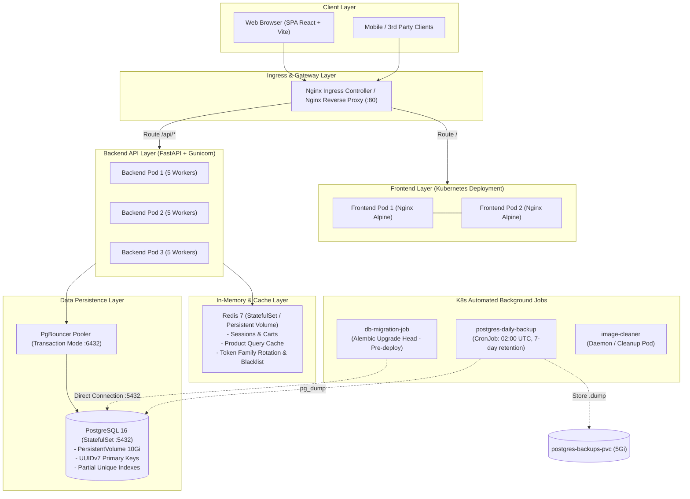
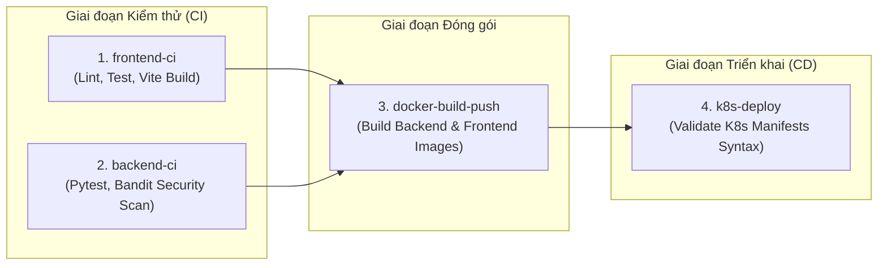
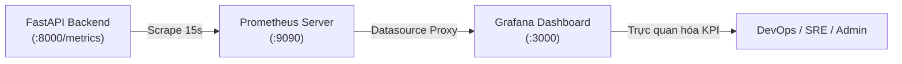

# 🛒 Enterprise Premium E-Commerce Platform

[](.github/workflows/ci-cd.yml)
[](https://fastapi.tiangolo.com)
[](https://www.python.org/)
[](https://react.dev/)
[](https://www.typescriptlang.org/)
[](https://www.postgresql.org/)
[](https://redis.io/)
[](https://www.pgbouncer.org/)
[](https://kubernetes.io/)
[](https://www.docker.com/)
[](LICENSE)

---

## 📌 Mục lục (Table of Contents)

- [📖 1. Tổng quan hệ thống (System Overview)](#-1-tổng-quan-hệ-thống-system-overview)
- [🏛️ 2. Kiến trúc hệ thống (System Architecture)](#️-2-kiến-trúc-hệ-thống-system-architecture)
  - [Sơ đồ luồng dữ liệu & hạ tầng (Architecture Diagram)](#sơ-đồ-luồng-dữ-liệu--hạ-tầng-architecture-diagram)
  - [Thiết kế kỹ thuật cốt lõi (Core Technical Highlights)](#thiết-kế-kỹ-thuật-cốt-lõi-core-technical-highlights)
- [🚀 3. Công nghệ sử dụng (Tech Stack)](#-3-công-nghệ-sử-dụng-tech-stack)
- [📂 4. Cấu trúc thư mục (Directory Structure)](#-4-cấu-trúc-thư-mục-directory-structure)
- [✨ 5. Các phân hệ chức năng (Features & Modules)](#-5-các-phân-hệ-chức-năng-features--modules)
  - [Phân hệ Cửa hàng & Khách hàng (Storefront)](#phân-hệ-cửa-hàng--khách-hàng-storefront)
  - [Phân hệ Giỏ hàng & Thanh toán (Cart & Checkout Flow)](#phân-hệ-giỏ-hàng--thanh-toán-cart--checkout-flow)
  - [Xác thực & Phân quyền bảo mật (Auth & RBAC)](#xác-thực--phân-quyền-bảo-mật-auth--rbac)
  - [Cổng quản trị Admin & Quản lý (Admin Portal)](#cổng-quản-trị-admin--quản-lý-admin-portal)
  - [Sao lưu & Phục hồi cơ sở dữ liệu (Database Backup & Restore)](#sao-lưu--phục-hồi-cơ-sở-dữ-liệu-database-backup--restore)
- [🔑 6. Tài khoản mẫu & Dữ liệu khởi tạo (Default Accounts & Seed Data)](#-6-tài-khoản-mẫu--dữ-liệu-khởi-tạo-default-accounts--seed-data)
- [⚙️ 7. Cấu hình biến môi trường (Environment Variables)](#️-7-cấu-hình-biến-môi-trường-environment-variables)
- [📦 8. Hướng dẫn cài đặt và Khởi chạy (Quick Start & Deployment)](#-8-hướng-dẫn-cài-đặt-và-khởi-chạy-quick-start--deployment)
  - [Chuẩn bị môi trường (Prerequisites)](#chuẩn-bị-môi-trường-prerequisites)
  - [Cách 1: Khởi chạy bằng Docker Compose (Khuyên dùng cho Dev)](#cách-1-khởi-chạy-bằng-docker-compose-khuyên-dùng-cho-dev)
  - [Cách 2: Triển khai trên Kubernetes (Minikube / Kind / Production)](#cách-2-triển-khai-trên-kubernetes-minikube--kind--production)
  - [Cập nhật nóng hệ thống trên Kubernetes (Hot Updates)](#cập-nhật-nóng-hệ-thống-trên-kubernetes-hot-updates)
- [🗄️ 9. Quản trị Cơ sở dữ liệu & Caching (Database & Cache Ops)](#️-9-quản-trị-cơ-sở-dữ-liệu--caching-database--cache-ops)
  - [Alembic Migrations](#alembic-migrations)
  - [Seed Dữ liệu & CLI Quản trị viên](#seed-dữ-liệu--cli-quản-trị-viên)
  - [Quản lý Redis Cache & Xử lý Cache Stale](#quản-lý-redis-cache--xử-lý-cache-stale)
  - [Backup & Restore Cơ sở dữ liệu](#backup--restore-cơ-sở-dữ-liệu)
- [🔌 10. Danh mục API Endpoints (API Reference)](#-10-danh-mục-api-endpoints-api-reference)
- [🧪 11. Kiểm thử & Đảm bảo chất lượng (Testing & Quality Assurance)](#-11-kiểm-thử--đảm-bảo-chất-lượng-testing--quality-assurance)
- [🔄 12. Quy trình CI/CD Pipeline (GitHub Actions)](#-12-quy-trình-cicd-pipeline-github-actions)
- [📊 13. Giám sát & Vận hành (Monitoring & Observability)](#-13-giám-sát--vận-hành-monitoring--observability)
- [🛠️ 14. Khắc phục sự cố thường gặp (Troubleshooting & FAQs)](#️-14-khắc-phục-sự-cố-thường-gặp-troubleshooting--faqs)

---

## 📖 1. Tổng quan hệ thống (System Overview)

**Enterprise Premium E-Commerce Platform** là một dự án thương mại điện tử cấp độ doanh nghiệp (Enterprise Grade) toàn diện. Dự án mô phỏng quy trình tiêu chuẩn công nghiệp hiện đại: từ khâu phân tích bài toán nghiệp vụ, thiết kế kiến trúc phân tán (Microservices/SOA), lập trình ứng dụng bất đồng bộ (Asynchronous I/O), xử lý giao dịch chịu tải cao (High Concurrency & ACID Integrity), đến kiểm thử tự động (Unit/Integration Testing, Security Scan) và tự động hóa vận hành trên nền tảng Cloud-Native Kubernetes & Docker.

### Điểm nổi bật:
- ⚡ **Tốc độ & Hiệu năng cao**: Backend FastAPI bất đồng bộ (`async`/`await`) kết hợp với Connection Pooler PgBouncer và Redis In-Memory Cache giảm thiểu độ trễ truy vấn (sub-millisecond latency).
- 🛡️ **Bảo mật & Toàn vẹn dữ liệu**: Mã hóa mật khẩu chuẩn Argon2, xác thực JWT kèm cơ chế **Token Family Rotation** chống tấn công phát lại (Replay Attacks), lọc log nhạy cảm tự động (Sensitive Data Redaction), phân quyền theo vai trò (RBAC: Customer, Manager, Admin).
- 🔒 **Kiểm soát đồng thời (Concurrency Control)**: Ngăn chặn triệt để tình trạng bán vượt số lượng tồn kho (Overselling) và Deadlock trong thanh toán bằng cơ chế **Pessimistic Locking** (`SELECT ... FOR UPDATE`) có sắp xếp thứ tự và trường `version` hỗ trợ Optimistic Locking.
- 📦 **Khả năng mở rộng (Scalability)**: Sẵn sàng triển khai cụm Kubernetes với 3 Backend Pods, 2 Frontend Pods, Ingress Controller, StatefulSets có Persistent Volumes cho PostgreSQL & Redis, cùng các Job tự động Migration và CronJob sao lưu dữ liệu định kỳ.

---

## 🏛️ 2. Kiến trúc hệ thống (System Architecture)

### Sơ đồ luồng dữ liệu & hạ tầng (Architecture Diagram)



---

### Thiết kế kỹ thuật cốt lõi (Core Technical Highlights)

1. **Khóa chính thời gian thực UUIDv7 (Time-Ordered Primary Keys)**:
   - Tất cả các bảng cơ sở dữ liệu (`User`, `Product`, `Category`, `Brand`, `Order`, `OrderItem`, `Address`, `Voucher`, `Payment`) sử dụng chuẩn **UUIDv7**.
   - **Ưu điểm**: Khắc phục hiện tượng phân mảnh chỉ mục (B-Tree index fragmentation) gây sụt giảm hiệu năng ghi của UUIDv4 ngẫu nhiên truyền thống, đồng thời không để lộ cấu trúc ID tuần tự (bảo vệ thông tin kinh doanh khỏi enumeration attack).
2. **Kiểm soát giao dịch & Khóa dòng chống quá bán (Pessimistic Locking & Concurrency Control)**:
   - Trong quá trình tạo đơn hàng (`create_order_with_transaction`), hệ thống sắp xếp danh sách sản phẩm theo ID rồi thực thi `SELECT ... FOR UPDATE` trong transaction của PostgreSQL.
   - Cơ chế này đảm bảo:
     - Không xảy ra tình trạng Deadlock giữa các giao dịch đồng thời.
     - Kiểm tra số lượng tồn kho và trừ kho trực tiếp trong transaction an toàn tuyệt đối.
     - Model `Product` lưu kèm thuộc tính `version` phục vụ xác thực lạc quan (Optimistic Concurrency).
3. **Cơ chế Token Family Rotation & Phát hiện tấn công phát lại (Replay Attack Detection)**:
   - Triển khai theo khuyến nghị RFC OAuth2 Security Best Current Practice.
   - Mỗi chu kỳ đăng nhập khởi tạo một `family_id` trong Redis. Khi Client đổi Refresh Token lấy Access Token mới, Token cũ được cấp thời gian ân hạn 30 giây (Grace Period) để chấp nhận trường hợp mạng chập chờn / retry song song.
   - Nếu phát hiện Refresh Token cũ bị sử dụng lại sau thời gian ân hạn, hệ thống lập tức thu hồi toàn bộ Family (`revoked_family`), vô hiệu hóa mọi phiên làm việc liên quan ngay tức thì.
4. **Xóa mềm với chỉ mục duy nhất có điều kiện (Soft Delete with Partial Unique Index)**:
   - Các bảng kế thừa `deleted_at`. Riêng bảng `User`, đảm bảo tính duy nhất của `email` và `username` thông qua PostgreSQL Partial Index:
     ```sql
     CREATE UNIQUE INDEX ix_users_email_unique ON users (email) WHERE deleted_at IS NULL;
     CREATE UNIQUE INDEX ix_users_username_unique ON users (username) WHERE deleted_at IS NULL;
     ```
   - Nhờ đó, người dùng đã bị xóa có thể tái đăng ký tài khoản với email cũ mà không gặp lỗi vi phạm ràng buộc Unique.
5. **Bộ lọc thông tin nhạy cảm trong Log (Sensitive Data Redaction)**:
   - Hệ thống áp dụng `RedactingFormatter` cho Python Logger. Toàn bộ chuỗi chứa mật khẩu (`"password"`), mã xác thực (`"token"`), hoặc thông tin thẻ (`"credit_card"`) đều tự động được mask thành `***REDACTED***` trước khi xuất ra STDOUT, ngăn ngừa rò rỉ dữ liệu qua ELK/Loki/CloudWatch.
6. **Pooler kết nối cơ sở dữ liệu (PgBouncer in Transaction Mode)**:
   - Thay vì mở trực tiếp hàng trăm kết nối ngốn RAM của PostgreSQL, Backend kết nối qua PgBouncer tại cổng `6432` với chế độ `transaction`.
   - Các tác vụ migration schema (Alembic) sẽ kết nối trực tiếp đến PostgreSQL tại cổng `5432` để đảm bảo thực thi đầy đủ các câu lệnh DDL mà không bị hạn chế bởi pooler.

---

## 🚀 3. Công nghệ sử dụng (Tech Stack)

| Phân hệ | Công nghệ / Thư viện | Phiên bản | Vai trò & Mục đích sử dụng |
| :--- | :--- | :--- | :--- |
| **Backend Framework** | [FastAPI](https://fastapi.tiangolo.com/) | `>=0.111.0` | Framework web bất đồng bộ hiệu năng cao, tự động sinh tài liệu Swagger/OpenAPI |
| **ASGI / WSGI Server**| [Uvicorn](https://www.uvicorn.org/) + [Gunicorn](https://gunicorn.org/) | `0.30+` / `22.0+` | Quản lý worker đa tiến trình (`UvicornWorker`), scale theo số nhân CPU |
| **Data Validation**   | [Pydantic](https://docs.pydantic.dev/) & Pydantic-Settings | `>=2.7.0` | Kiểm tra dữ liệu đầu vào/ra nghiêm ngặt, đọc cấu hình môi trường |
| **ORM & Database**    | [SQLAlchemy 2.0](https://www.sqlalchemy.org/) + [asyncpg](https://github.com/MagicStack/asyncpg) | `2.0.30` / `0.29.0` | Async ORM hiện đại, kết nối PostgreSQL bất đồng bộ thuần binary protocol |
| **Schema Migration**  | [Alembic](https://alembic.sqlalchemy.org/) | `>=1.13.1` | Quản lý phiên bản cấu trúc cơ sở dữ liệu (Database Migrations) |
| **Caching & Session** | [Redis](https://redis.io/) (via `redis.asyncio`) | `7-alpine` / `>=5.0.4` | Caching sản phẩm, giỏ hàng người dùng, quản lý Token Family Rotation |
| **Connection Pool**   | [PgBouncer](https://www.pgbouncer.org/) | `latest` (edoburu) | Transaction-level connection pooling tối ưu tải kết nối cơ sở dữ liệu |
| **Database Engine**   | [PostgreSQL](https://www.postgresql.org/) | `16-alpine` | Cơ sở dữ liệu quan hệ chính, lưu trữ bền vững với ACID tuyệt đối |
| **Security & Auth**   | [Passlib](https://passlib.readthedocs.io/) (Argon2) + [PyJWT](https://pyjwt.readthedocs.io/) | `1.7.4` / `2.8.0` | Hashing mật khẩu chuẩn tương lai Argon2id, ký và giải mã JWT token |
| **UUID Generator**    | [uuid6](https://github.com/oittaa/uuid6-python) | `>=2024.1.12` | Sinh UUIDv7 có sắp xếp thời gian (time-ordered) |
| **Frontend Framework**| [React](https://react.dev/) + [Vite](https://vitejs.dev/) | `18.2` / `4.4+` | Thư viện giao diện SPA hiện đại, build tool tốc độ cao |
| **Language (FE)**     | [TypeScript](https://www.typescriptlang.org/) | `>=5.0.2` | Đảm bảo tính nhất quán của kiểu dữ liệu toàn bộ ứng dụng |
| **Routing (FE)**      | [Wouter](https://github.com/molefrog/wouter) | `^3.10.0` | Thư viện routing siêu nhẹ (~1.5KB), tối ưu kích thước bundle |
| **State Management**  | [Zustand](https://github.com/pmndrs/zustand) | `^5.0.15` | Global state management nhẹ nhàng, linh hoạt, hiệu năng cao |
| **Styling & UI**      | [TailwindCSS](https://tailwindcss.com/) + [Motion](https://motion.dev/) | `3.3.3` / `13.1+` | Utility-first CSS, chuyển động mượt mà (Framer Motion) |
| **Components & Icons**| [Phosphor Icons](https://phosphoricons.com/) + [Sonner](https://sonner.emilkowal.ski/) | `2.1+` / `1.5+` | Bộ icon cao cấp và hệ thống Toast notification tinh tế |
| **Containerization**  | [Docker](https://www.docker.com/) & Docker Compose | Multi-stage | Đóng gói môi trường đồng nhất giữa Dev và Production |
| **Orchestration**    | [Kubernetes](https://kubernetes.io/) (K8s) | `v1.28+` | Quản trị cụm Pods, tự động phục hồi (Self-healing), rolling updates |
| **Ingress & Proxy**   | [Nginx](https://nginx.org/) | `alpine` | Cân bằng tải, reverse proxy, phục vụ file tĩnh và nén Gzip |
| **Testing Backend**   | [Pytest](https://docs.pytest.org/) + `pytest-asyncio` + `pytest-cov` | `8.2+` | Kiểm thử tự động Async API, đo lường độ phủ code |
| **Testing Frontend**  | [Vitest](https://vitest.dev/) + React Testing Library + JSDOM | `4.1+` | Kiểm thử Component, Custom Hooks và Store |
| **Security Scanner**  | [Bandit](https://github.com/PyCQA/bandit) | Latest | Quét tĩnh mã nguồn Python phát hiện các lỗ hổng bảo mật phổ biến |
| **CI/CD**             | [GitHub Actions](https://github.com/features/actions) | v4/v5 | Tự động hóa kiểm thử, build Docker images, validate K8s manifests |
| **Monitoring**        | [Prometheus](https://prometheus.io/) + [Grafana](https://grafana.com/) | v2.x / v10.x | Thu thập metrics hiệu năng API và trực quan hóa dashboard |

---

## 📂 4. Cấu trúc thư mục (Directory Structure)

```plaintext
ecommerce/
├── .github/
│   └── workflows/
│       └── ci-cd.yml                # Pipeline CI/CD tự động (Lint, Test, Build, K8s Validate)
├── backend/
│   ├── alembic/
│   │   ├── env.py                   # Cấu hình môi trường Async migration cho Alembic
│   │   └── versions/                # Lịch sử các file migration database
│   ├── app/
│   │   ├── api/
│   │   │   ├── deps.py              # Dependencies: get_current_user, get_current_admin, get_current_staff
│   │   │   └── v1/endpoints/
│   │   │       ├── addresses.py     # API quản lý sổ địa chỉ giao hàng
│   │   │       ├── auth.py          # API đăng ký, đăng nhập, đổi token, thông tin me
│   │   │       ├── backup.py        # API quản trị sao lưu & phục hồi cơ sở dữ liệu
│   │   │       ├── brands.py        # API quản lý thương hiệu
│   │   │       ├── cart.py          # API giỏ hàng người dùng (Redis Cache)
│   │   │       ├── categories.py    # API quản lý danh mục sản phẩm
│   │   │       ├── orders.py        # API đặt hàng, hủy đơn, danh sách đơn (Pessimistic Lock)
│   │   │       ├── payments.py      # API thanh toán & mock webhook xác thực chữ ký
│   │   │       ├── products.py      # API xem sản phẩm, bộ lọc đa chiều, quản trị CRUD
│   │   │       ├── users.py         # API quản trị tài khoản người dùng & phân quyền
│   │   │       └── vouchers.py      # API mã giảm giá, kiểm tra tính hợp lệ
│   │   ├── core/
│   │   │   ├── config.py            # Cấu hình Pydantic BaseSettings đọc biến môi trường
│   │   │   ├── db.py                # Khởi tạo Async Engine, SessionFactory
│   │   │   ├── logging.py           # Custom RedactingFormatter che dấu thông tin nhạy cảm
│   │   │   ├── redis.py             # Khởi tạo kết nối Redis async connection pool
│   │   │   ├── security.py          # Xử lý Argon2 password hashing & JWT token encode/decode
│   │   │   └── utils.py             # Hàm sinh UUIDv7
│   │   ├── crud/                    # Data Access Layer (Repository Pattern)
│   │   │   ├── brand.py             # CRUD Brand
│   │   │   ├── order.py             # CRUD Order với Pessimistic Lock & Stock check
│   │   │   ├── product.py           # CRUD Product với SELECT FOR UPDATE
│   │   │   ├── user.py              # CRUD User
│   │   │   └── voucher.py           # CRUD Voucher & điều kiện áp dụng
│   │   ├── models/                  # SQLAlchemy Declarative Models (UUIDv7, Soft-delete)
│   │   │   ├── address.py           # Model Address
│   │   │   ├── base.py              # Base Model (created_at, updated_at, deleted_at)
│   │   │   ├── brand.py             # Model Brand
│   │   │   ├── order.py             # Model Order, OrderItem, Payment
│   │   │   ├── product.py           # Model Product, Category (có version lock)
│   │   │   ├── user.py              # Model User (Partial Unique Index)
│   │   │   └── voucher.py           # Model Voucher
│   │   ├── schemas/                 # Pydantic Schemas (Request/Response DTOs)
│   │   ├── services/                # Business Logic Services
│   │   │   ├── cart.py              # Giỏ hàng lưu trữ Redis
│   │   │   ├── token.py             # Token Family Rotation & Replay Attack Defense
│   │   │   └── user.py              # Logic nghiệp vụ người dùng
│   │   └── main.py                  # Điểm khởi tạo FastAPI App, Router, Middleware, CORS
│   ├── tests/                       # Bộ kiểm thử tự động toàn diện
│   │   ├── api/                     # Test endpoints (Auth, Admin, Orders, Payments, Products, Users)
│   │   ├── core/                    # Test DB config, Security hashing, Log redaction
│   │   └── domain/                  # Test Models, UUIDv7, User Domain Service
│   ├── alembic.ini                  # File cấu hình Alembic
│   ├── bandit.yaml                  # Cấu hình quét mã độc / lỗ hổng bảo mật Bandit
│   ├── create_admin.py              # CLI tạo tài khoản Admin tối cao
│   ├── create_staff.py              # CLI tạo tài khoản Staff (Manager / Admin)
│   ├── seed_db.py                   # Script khởi tạo 100+ sản phẩm, danh mục, thương hiệu, vouchers, demo users
│   ├── entrypoint.sh                # Container entrypoint: tính toán CPU workers, migration, khởi động Gunicorn
│   ├── Dockerfile                   # Dockerfile Backend đa tầng tối ưu dung lượng
│   └── requirements.txt             # Danh mục thư viện Python
├── frontend/
│   ├── src/
│   │   ├── components/
│   │   │   ├── layout/              # Navbar (Floating), Footer
│   │   │   ├── profile/             # AddressModal, OrderHistory, InfoCard
│   │   │   ├── sections/            # Hero, FeaturedProducts, Categories, Brands
│   │   │   └── ui/                  # Button, Input, Modal, Badge, Card
│   │   ├── pages/
│   │   │   ├── Admin.tsx            # Trang Quản trị viên (8 Tab: Overview, Products, Brands, Vouchers, Orders, Users, Categories, Backups)
│   │   │   ├── Cart.tsx             # Trang Giỏ hàng
│   │   │   ├── Checkout.tsx         # Trang Thanh toán chọn địa chỉ, áp voucher, phương thức trả
│   │   │   ├── Login.tsx            # Trang Đăng nhập
│   │   │   ├── PaymentResult.tsx    # Trang Thông báo kết quả thanh toán & đơn hàng
│   │   │   ├── ProductDetail.tsx    # Trang Chi tiết sản phẩm & thêm vào giỏ
│   │   │   ├── ProductsPage.tsx     # Trang Danh sách sản phẩm với bộ lọc đa chiều & tìm kiếm
│   │   │   ├── Profile.tsx          # Trang Hồ sơ cá nhân, đổi thông tin, sổ địa chỉ, lịch sử đơn
│   │   │   ├── Register.tsx         # Trang Đăng ký người dùng
│   │   │   └── Storefront.tsx       # Trang chủ Trang trọng (Landing page)
│   │   ├── store/                   # Zustand Stores (useAuthStore, useCartStore, useProductStore)
│   │   ├── App.tsx                  # Khởi tạo App & Wouter Route Switch
│   │   └── main.tsx                 # Entrypoint React 18 DOM
│   ├── nginx.conf                   # Cấu hình Nginx phục vụ SPA & Proxy API ngược về Backend
│   ├── Dockerfile                   # Dockerfile Frontend Multi-Stage Build (Node 20 -> Nginx Alpine)
│   ├── package.json                 # Danh mục thư viện và scripts Frontend
│   └── vitest.config.ts             # Cấu hình Vitest runner
├── k8s/                             # Toàn bộ Manifests triển khai Kubernetes
│   ├── backend.yaml                 # Deployment (3 Replicas) + Service ClusterIP
│   ├── cleaner.yaml                 # Job dọn dẹp image cũ khỏi node containerd
│   ├── frontend.yaml                # Deployment (2 Replicas) + Service LoadBalancer
│   ├── ingress.yaml                 # Ingress routing `/api` -> backend và `/` -> frontend
│   ├── migration-job.yaml           # Job tự động chạy Alembic upgrade head trước khi mở traffic
│   ├── pgbouncer.yaml               # Deployment (2 Replicas) + Service PgBouncer
│   ├── postgres.yaml                # StatefulSet PostgreSQL + Headless Service + PVC 10Gi
│   ├── postgres-backup.yaml         # PersistentVolumeClaim 5Gi + CronJob sao lưu hàng ngày lúc 02:00 UTC
│   └── redis.yaml                   # StatefulSet Redis + Service + PVC 2Gi
├── monitoring/
│   ├── prometheus.yml               # Cấu hình scrape metrics backend định kỳ 15s
│   └── grafana-dashboard.json       # Dashboard mẫu theo dõi Request Rate và trạng thái hệ thống
├── nginx/
│   └── conf.d/default.conf          # Cấu hình Reverse Proxy Nginx cho môi trường Docker Compose
├── pgbouncer/
│   └── pgbouncer.ini                # Cấu hình Transaction Pool, Port 6432, Scram-sha-256
├── scripts/
│   ├── backup-db.sh                 # Script Bash sao lưu database thủ công (hỗ trợ cả K8s và Docker)
│   └── restore-db.sh                # Script Bash phục hồi database từ file .dump (hỗ trợ cả K8s và Docker)
├── .env.example                     # File mẫu biến môi trường
├── docker-compose.yml               # Cấu hình khởi chạy toàn bộ hệ thống bằng Docker Compose
├── start-docker.sh / .bat           # Script khởi chạy Docker Compose 1-click (Linux / Windows)
├── stop-docker.sh / .bat            # Script dừng và xóa volumes Docker Compose (Linux / Windows)
├── start-k8s-linux.sh               # Script tự động hóa triển khai Kubernetes thông minh cho Linux
├── start-k8s.sh / .bat              # Script triển khai Kubernetes tiêu chuẩn (Linux / Windows)
├── stop-k8s.sh / .bat               # Script gỡ bỏ tài nguyên Kubernetes (Linux / Windows)
├── status.sh / .bat                 # Script kiểm tra trạng thái sức khỏe toàn bộ hệ thống (Docker & K8s)
├── update-k8s-backend.sh / .bat     # Script cập nhật nóng Backend image lên Kubernetes
├── update-k8s-frontend.sh / .bat    # Script cập nhật nóng Frontend image lên Kubernetes
├── K8S-TROUBLESHOOTING.md           # Hướng dẫn chi tiết khắc phục các lỗi K8s thực tế
└── REDIS-TROUBLESHOOTING.md         # Hướng dẫn chi tiết khắc phục các lỗi Redis Cache Stale
```

---

## ✨ 5. Các phân hệ chức năng (Features & Modules)

### Phân hệ Cửa hàng & Khách hàng (Storefront)
- **Trang chủ (Storefront)**: Thiết kế giao diện hiện đại, sang trọng (Luxury/Modern UI), Hero banner tương tác, hiển thị các bộ sưu tập nổi bật, thương hiệu đối tác và cam kết chất lượng.
- **Danh mục & Bộ lọc sản phẩm (Catalog & Filtering)**:
  - Tìm kiếm tức thì theo từ khóa tên và mô tả sản phẩm.
  - Lọc theo Danh mục (Apparel, Footwear, Accessories, Home...).
  - Lọc theo Thương hiệu (Nike, Apple, Sony, Uniqlo, Acme...).
  - Lọc theo khoảng giá linh hoạt (Min Price - Max Price).
  - Sắp xếp sản phẩm đa tiêu chí: Mới nhất, Giá tăng dần, Giá giảm dần, Đánh giá cao nhất.
  - Phân trang bất đồng bộ (Pagination).
- **Chi tiết sản phẩm (Product Detail)**: Hình ảnh chất lượng cao, mô tả thông số chi tiết, tình trạng tồn kho tức thời (In Stock / Out of Stock), đánh giá sao và thương hiệu liên quan.

### Phân hệ Giỏ hàng & Thanh toán (Cart & Checkout Flow)
- **Giỏ hàng lưu trữ Redis (In-Memory Cart)**:
  - Dữ liệu giỏ hàng được đồng bộ và lưu trữ trực tiếp trong Redis theo `user_id`, cho phép thêm, sửa số lượng, xóa từng món hoặc dọn sạch giỏ hàng với tốc độ phản hồi tính bằng mili-giây.
- **Sổ địa chỉ người dùng (Address Book)**:
  - Hỗ trợ lưu trữ nhiều địa chỉ nhận hàng chi tiết (Tỉnh/Thành, Quận/Huyện, Phường/Xã, Số nhà/Tên đường, Số điện thoại người nhận).
  - Cho phép thiết lập một địa chỉ làm địa chỉ mặc định (Default Address).
- **Áp dụng Mã giảm giá (Vouchers Engine)**:
  - Hỗ trợ 2 hình thức giảm giá: Giảm theo phần trăm (`PERCENTAGE`) và Giảm số tiền cố định (`FIXED`).
  - Tự động kiểm tra giá trị đơn hàng tối thiểu (`min_order_amount`), giới hạn số tiền giảm tối đa (`max_discount_amount`), hạn sử dụng và số lần sử dụng tối đa (`usage_limit`).
- **Xử lý đơn hàng an toàn (Atomic Order Processing)**:
  - Khóa dòng sản phẩm bằng **Pessimistic Locking** (`FOR UPDATE`) để trừ tồn kho an toàn trong cùng một transaction.
  - Hỗ trợ các phương thức thanh toán: COD (Tiền mặt khi nhận hàng), Chuyển khoản ngân hàng (Bank Transfer), và Cổng thanh toán trực tuyến mô phỏng (Mock Gateway).

### Xác thực & Phân quyền bảo mật (Auth & RBAC)
- **Cơ chế xác thực**:
  - Hashing mật khẩu với giải thuật **Argon2** (chống brute-force và GPU cracking vượt trội so với bcrypt thông thường).
  - Cấp phát Access Token (thời hạn ngắn, 15-30 phút) và Refresh Token (thời hạn dài, 7 ngày).
  - Quản lý trạng thái theo **Token Family Rotation**: Nếu một Refresh Token bị tái sử dụng bất hợp pháp, toàn bộ chuỗi token thuộc Family đó sẽ bị vô hiệu hóa ngay lập tức.
- **Mô hình phân quyền 3 cấp độ (Role-Based Access Control)**:
  - 👤 **`customer`**: Xem sản phẩm, quản lý giỏ hàng, đặt hàng, quản lý sổ địa chỉ cá nhân, xem và hủy đơn hàng của chính mình.
  - 👔 **`manager` (Staff)**: Được cấp quyền quản trị vận hành: Quản lý danh mục, tạo và chỉnh sửa sản phẩm, quản lý thương hiệu, tạo mã voucher khuyến mãi, xem và cập nhật trạng thái đơn hàng của khách hàng. Không có quyền can thiệp vào tài khoản người dùng hoặc thao tác sao lưu database.
  - 👑 **`admin` (Super Admin)**: Toàn quyền trên hệ thống: Bao gồm toàn bộ quyền của Manager, cộng thêm quyền quản lý phân quyền người dùng (nâng cấp quyền thành Manager/Admin hoặc khóa tài khoản), và quyền sao lưu/phục hồi cơ sở dữ liệu.

### Cổng quản trị Admin & Quản lý (Admin Portal)
Truy cập tại URL: `http://localhost/admin` (hoặc `http://<domain>/admin`). Giao diện Admin được chia thành 8 phân hệ chuyên biệt:
1. 📊 **Overview**: Thống kê số lượng sản phẩm, đơn hàng, người dùng, tổng doanh thu và tình trạng các dịch vụ.
2. 📦 **Products**: Bảng danh sách sản phẩm, thêm mới, sửa giá bán, cập nhật số lượng tồn kho, chọn thương hiệu, danh mục, xóa sản phẩm (tự động xóa cache Redis tương ứng).
3. 🏷️ **Brands**: Quản lý thương hiệu đối tác, logo URL, mô tả và website.
4. 🎟️ **Vouchers**: Tạo và quản lý mã giảm giá, thiết lập loại giảm giá, số tiền tối thiểu, mức giảm tối đa, giới hạn số lượt sử dụng và ngày hết hạn.
5. 📋 **Orders**: Quản lý toàn bộ đơn hàng trong hệ thống, lọc đơn theo trạng thái (`PENDING`, `PROCESSING`, `SHIPPED`, `DELIVERED`, `CANCELLED`), cập nhật trạng thái đơn hàng và theo dõi thông tin thanh toán.
6. 👥 **Users**: Danh sách thành viên, chuyển đổi vai trò người dùng (`customer` ↔ `manager` ↔ `admin`), kích hoạt hoặc vô hiệu hóa tài khoản (`is_active`).
7. 🗂️ **Categories**: Quản lý danh mục cây phân cấp, tên danh mục và slug.
8. 💾 **Backups**: Xem danh sách các file sao lưu database `.dump`, kích thước, ngày tạo; bấm 1 nút để tạo bản backup tức thì (On-Demand Backup) hoặc khôi phục dữ liệu (Restore) trực tiếp từ giao diện.

### Sao lưu & Phục hồi cơ sở dữ liệu (Database Backup & Restore)
- Hỗ trợ tạo file dump nén định dạng custom của PostgreSQL (`pg_dump -F c -b`).
- Tự động hóa qua Kubernetes CronJob định kỳ mỗi ngày lúc 02:00 UTC, tự động xóa các file backup cũ hơn 7 ngày để tiết kiệm dung lượng lưu trữ.
- API và Script hỗ trợ khôi phục database với cờ `--clean --if-exists`, an toàn và không gây xung đột cấu trúc.

---

## 🔑 6. Tài khoản mẫu & Dữ liệu khởi tạo (Default Accounts & Seed Data)

Khi khởi chạy hệ thống lần đầu hoặc sau khi chạy lệnh seed dữ liệu (`python seed_db.py`), hệ thống tự động chuẩn bị sẵn tập dữ liệu phong phú để thử nghiệm:

### 1. Danh sách tài khoản thử nghiệm

| Vai trò (Role) | Tên đăng nhập | Email | Mật khẩu | Phạm vi quyền hạn |
| :--- | :--- | :--- | :--- | :--- |
| **Super Admin** | `admin1` | `admin1@example.com` | `admin123` | **Toàn quyền hệ thống**: Quản lý Users, Tạo/Restore Backup DB, Quản lý Sản phẩm, Đơn hàng, Voucher |
| **Super Admin** | `admin2` | `admin2@example.com` | `admin123` | Tài khoản Admin dự phòng |
| **Manager (Staff)** | `manager1` | `manager1@example.com` | `manager123` | **Quản lý vận hành**: Quản lý Sản phẩm, Danh mục, Thương hiệu, Voucher, Cập nhật trạng thái Đơn hàng |
| **Customer** | `user1` | `user1@example.com` | `user123` | Khách hàng mua sắm, quản lý giỏ hàng, đặt hàng, sổ địa chỉ |
| **Customer** | `user2` đến `user10` | `user[2-10]@example.com` | `user123` | Các tài khoản khách hàng mẫu khác |

### 2. Dữ liệu mẫu được nạp sẵn:
- **100+ Sản phẩm chất lượng**: Đa dạng các mặt hàng từ Quần áo thời trang, Giày thể thao, Phụ kiện, Đồ gia dụng cao cấp, có sẵn hình ảnh Unsplash, đánh giá sao ngẫu nhiên (3.5 - 5.0) và số lượng tồn kho thực tế.
- **4 Danh mục chính**: `Apparel` (Thời trang), `Footwear` (Giày dép), `Accessories` (Phụ kiện), `Home` (Đồ gia dụng).
- **Thương hiệu uy tín**: Nike, Apple, Sony, Uniqlo, Acme, Pace, Hide, Vision...
- **Mã Voucher giảm giá hoạt động ngay**:
  - `WELCOME10`: Giảm **10%** cho đơn hàng từ **$20**, mức giảm tối đa **$50** (Giới hạn 1000 lượt).
  - `FREESHIP`: Giảm thẳng **$5.00** cho đơn hàng từ **$15** (Giới hạn 500 lượt).
  - `SUPERVIP`: Giảm **25%** cho đơn hàng từ **$100**, mức giảm tối đa **$100** (Giới hạn 50 lượt).

---

## ⚙️ 7. Cấu hình biến môi trường (Environment Variables)

Hệ thống sử dụng file `.env` đặt tại thư mục gốc để nạp cấu hình đồng nhất cho cả Docker Compose và Kubernetes Secrets:

| Tên biến | Kiểu dữ liệu | Giá trị mặc định gợi ý | Ý nghĩa & Mô tả |
| :--- | :---: | :--- | :--- |
| `POSTGRES_USER` | `string` | `ecommerce_user` | Tên người dùng quản trị cơ sở dữ liệu PostgreSQL |
| `POSTGRES_PASSWORD` | `string` | `ecommerce_password` | Mật khẩu xác thực người dùng PostgreSQL |
| `POSTGRES_DB` | `string` | `ecommerce_db` | Tên cơ sở dữ liệu chính của hệ thống |
| `REDIS_PASSWORD` | `string` | `secure_redis_password` | Mật khẩu bảo vệ máy chủ Redis In-Memory |
| `SECRET_KEY` | `string` | *(Chuỗi ngẫu nhiên dài 32+ ký tự)* | Khóa bí mật dùng để mã hóa và xác thực JWT token |

> [!TIP]
> Một file mẫu `.env.example` đã được tạo sẵn trong thư mục gốc. Khi cài đặt mới, bạn chỉ cần sao chép:
> ```bash
> cp .env.example .env
> ```

---

## 📦 8. Hướng dẫn cài đặt và Khởi chạy (Quick Start & Deployment)

### Chuẩn bị môi trường (Prerequisites)
- Đã cài đặt **Docker** (phiên bản `>= 24.0`) và **Docker Compose** (phiên bản `>= 2.20`).
- Nếu muốn triển khai Kubernetes: Cần thêm **kubectl** và một cụm Kubernetes cục bộ như **Minikube**, **Kind**, hoặc **Docker Desktop Kubernetes**.

---

### Cách 1: Khởi chạy bằng Docker Compose (Khuyên dùng cho Dev)

Phương pháp nhanh nhất, tự động khởi tạo toàn bộ 5 dịch vụ (`postgres`, `redis`, `pgbouncer`, `backend`, `frontend`) và tự động chạy migration database:

#### Trên Linux / macOS:
```bash
# 1. Khởi động toàn bộ dịch vụ ở chế độ chạy ngầm
bash start-docker.sh

# 2. Kiểm tra trạng thái các container đang chạy
bash status.sh

# 3. Dừng và gỡ bỏ container cùng dữ liệu volumes khi không sử dụng
bash stop-docker.sh
```

#### Trên Windows:
```cmd
:: 1. Khởi động toàn bộ hệ thống
start-docker.bat

:: 2. Kiểm tra trạng thái
status.bat

:: 3. Dừng hệ thống
stop-docker.bat
```

#### Địa chỉ truy cập ứng dụng (Docker Compose):
- 🌐 **Giao diện người dùng (Frontend)**: [http://localhost](http://localhost) (Cổng 80)
- 🔌 **API Documentation (Swagger UI)**: [http://localhost:8000/docs](http://localhost:8000/docs)
- 📊 **Hệ thống giám sát (Grafana Dashboard)**: [http://localhost:3000](http://localhost:3000) (Tài khoản mặc định: `admin` / `admin`)
- 📈 **Máy chủ thu thập Metrics (Prometheus)**: [http://localhost:9090](http://localhost:9090)
- 🎯 **Chỉ số hiệu năng Backend (Metrics)**: [http://localhost:8000/metrics](http://localhost:8000/metrics)
- 🛠️ **Cổng kết nối PgBouncer**: `localhost:6432`
- 🗄️ **Cổng kết nối PostgreSQL**: `localhost:5432`
- ⚡ **Cổng kết nối Redis**: `localhost:6379`

---

### Cách 2: Triển khai trên Kubernetes (Minikube / Kind / Production)

Mô hình triển khai chuẩn Production bao gồm Ingress Controller, tự động chia tải, phân lập Secret và tự động chạy `db-migration-job` trước khi Backend Pod nhận traffic.

#### 1. Triển khai tự động thông minh trên Linux (Tối ưu cho Minikube / Kind):
Dự án cung cấp script tự động hóa [start-k8s-linux.sh](file:///home/tringuyen/Documents/GitHub/ecommerce/start-k8s-linux.sh). Script này sẽ tự động:
- Kiểm tra Docker daemon và kubectl.
- Kiểm tra / khởi động Minikube (driver Docker) hoặc Kind.
- Tự động cấu hình DNS server (`8.8.8.8`) trong node Minikube để tránh lỗi rớt mạng do VPN/systemd-resolved.
- Bật addon `ingress` trên Minikube.
- Tắt Docker Compose (nếu đang chạy) để tránh xung đột cổng 80.
- Tạo Kubernetes Secrets (`app-secrets`, `db-secrets`) từ file `.env`.
- Build Docker image cho backend và frontend rồi nạp trực tiếp vào cụm K8s (`minikube image load` / `kind load`).
- Áp dụng toàn bộ manifests trong thư mục `k8s/`.

Chạy lệnh:
```bash
chmod +x start-k8s-linux.sh
./start-k8s-linux.sh
```

#### 2. Triển khai tiêu chuẩn bằng script thông thường:
- **Trên Linux/macOS**:
  ```bash
  bash start-k8s.sh
  ```
- **Trên Windows**:
  ```cmd
  start-k8s.bat
  ```

#### 3. Cách truy cập ứng dụng trên Kubernetes Minikube:
Tùy vào cách bạn muốn mở traffic, chọn 1 trong 2 cách sau:

- **Cách A (Nhanh nhất - Không cần quyền root)**:
  Chạy lệnh để Minikube tự mở trình duyệt tới NodePort của frontend:
  ```bash
  minikube service frontend
  ```
- **Cách B (Truy cập trực tiếp qua cổng 80 `http://localhost`)**:
  Mở một cửa sổ Terminal mới và giữ tiến trình tunnel chạy ngầm:
  ```bash
  minikube tunnel
  ```
  Sau đó mở trình duyệt truy cập: [http://localhost](http://localhost).

#### 4. Kiểm tra trạng thái cụm K8s:
```bash
bash status.sh
# hoặc kiểm tra trực tiếp qua kubectl
kubectl get pods,svc,ingress,jobs,cronjobs
```

#### 5. Dừng và gỡ bỏ triển khai Kubernetes:
```bash
bash stop-k8s.sh
# Hoặc trên Windows:
stop-k8s.bat
```

---

### Cập nhật nóng hệ thống trên Kubernetes (Hot Updates)

Khi bạn thực hiện thay đổi mã nguồn ở Backend hoặc Frontend, bạn không cần xóa toàn bộ cụm K8s mà có thể sử dụng các script cập nhật nóng để build lại image, nạp lại vào cụm và thực hiện Rolling Restart chỉ trong vài giây:

- **Cập nhật Backend**:
  ```bash
  bash update-k8s-backend.sh    # Trên Linux
  # hoặc update-k8s-backend.bat  # Trên Windows
  ```
- **Cập nhật Frontend**:
  ```bash
  bash update-k8s-frontend.sh   # Trên Linux
  # hoặc update-k8s-frontend.bat # Trên Windows
  ```

---

## 🗄️ 9. Quản trị Cơ sở dữ liệu & Caching (Database & Cache Ops)

### Alembic Migrations

Mỗi khi thay đổi cấu trúc Model SQLAlchemy trong `backend/app/models/`, bạn quản lý schema bằng các câu lệnh Alembic:

```bash
cd backend

# Tạo file migration tự động dựa trên sự thay đổi của Models
alembic revision --autogenerate -m "mo_ta_thay_doi"

# Nâng cấp cơ sở dữ liệu lên phiên bản mới nhất
alembic upgrade head

# Hạ cấp cơ sở dữ liệu về phiên bản trước đó (Rollback)
alembic downgrade -1
```

> [!NOTE]
> Khi chạy trong Kubernetes, `migration-job.yaml` sẽ tự động thực thi `alembic upgrade head` mỗi lần triển khai để đồng bộ cấu trúc bảng trước khi Pod backend nhận request.

---

### Seed Dữ liệu & CLI Quản trị viên

#### 1. Nạp dữ liệu mẫu 100+ sản phẩm & tài khoản demo:
- **Nếu đang chạy Docker Compose**:
  ```bash
  docker-compose exec backend python seed_db.py
  ```
- **Nếu đang chạy Kubernetes**:
  ```bash
  kubectl exec -it deployment/backend -- python seed_db.py
  ```

#### 2. Tạo tài khoản Admin mới qua dòng lệnh:
```bash
# Trong thư mục backend (hoặc chạy qua docker/kubectl exec):
python create_admin.py --username superadmin --email admin@domain.com --password MatKhauManh123@
```

#### 3. Tạo tài khoản Staff (Manager / Admin) qua dòng lệnh:
```bash
python create_staff.py --username kho_manager --email manager@domain.com --password MatKhauManh123@ --role manager
```

---

### Quản lý Redis Cache & Xử lý Cache Stale

Hệ thống cache danh sách sản phẩm tại `/api/v1/products/` trong Redis (thời gian sống 300 giây) để giảm tải triệt để cho Database.

> [!WARNING]
> **Hiện tượng Cache Stale**: Nếu bạn nạp dữ liệu bằng script `seed_db.py` trực tiếp vào Database, Redis sẽ không nhận biết được dữ liệu mới nếu trước đó đã có request gọi vào API rỗng.
> Bạn cần xóa (flush) cache Redis theo hướng dẫn dưới đây để API lập tức lấy dữ liệu mới nhất:

- **Trên Kubernetes**:
  ```bash
  kubectl exec statefulset/redis -n default -- redis-cli -a secure_redis_password flushall
  ```
- **Trên Docker Compose**:
  ```bash
  docker-compose exec redis redis-cli -a secure_redis_password flushall
  ```

---

### Backup & Restore Cơ sở dữ liệu

Dự án cung cấp bộ công cụ toàn diện hỗ trợ sao lưu và khôi phục dữ liệu ở mọi môi trường:

#### 1. Sao lưu thủ công bằng script ([scripts/backup-db.sh](file:///home/tringuyen/Documents/GitHub/ecommerce/scripts/backup-db.sh)):
Script tự động nhận diện hệ thống đang chạy trên Kubernetes (`postgres-0`) hay Docker (`postgres`) để xuất file `.dump`:
```bash
bash scripts/backup-db.sh
# Kết quả lưu tại: ./backups/db_backup_YYYYMMDD_HHMMSS.dump
```

#### 2. Khôi phục thủ công bằng script ([scripts/restore-db.sh](file:///home/tringuyen/Documents/GitHub/ecommerce/scripts/restore-db.sh)):
```bash
bash scripts/restore-db.sh ./backups/db_backup_20260911_020000.dump
```

#### 3. Sao lưu tự động bằng Kubernetes CronJob:
- CronJob `postgres-daily-backup` được lập lịch chạy vào lúc **02:00 sáng hàng ngày (UTC)**.
- Dữ liệu được lưu trữ an toàn trong PVC `postgres-backups-pvc` (5Gi).
- Tự động tìm kiếm và xóa bỏ các bản sao lưu cũ hơn 7 ngày (`find /backups -name "*.dump" -mtime +7 -delete`).

#### 4. Sao lưu & Khôi phục trực quan qua giao diện Admin:
Admin có thể truy cập tab **Backups** trên trang quản trị `/admin`, bấm **Create Backup Now** để sinh bản sao lưu tức thời hoặc bấm **Restore** trực tiếp trên từng file dump có sẵn.

---

## 🔌 10. Danh mục API Endpoints (API Reference)

Khi hệ thống khởi chạy ở môi trường Development, tài liệu tương tác Swagger UI được kích hoạt tại:
👉 **[http://localhost:8000/docs](http://localhost:8000/docs)** (hoặc định dạng Redoc tại `/redoc`).

### Bảng tóm tắt các Endpoints chính:

| Nhóm chức năng | Phương thức | Endpoint | Phân quyền | Mô tả chức năng |
| :--- | :---: | :--- | :---: | :--- |
| **Health** | `GET` | `/api/health` | Public | Kiểm tra tình trạng hoạt động của dịch vụ backend |
| **Auth** | `POST` | `/api/v1/auth/register` | Public | Đăng ký tài khoản người dùng mới (Role: `customer`) |
| | `POST` | `/api/v1/auth/login` | Public | Đăng nhập hệ thống, trả về `access_token` & `refresh_token` |
| | `POST` | `/api/v1/auth/refresh` | Public | Đổi Refresh Token mới (Hỗ trợ Token Family Rotation) |
| | `GET` | `/api/v1/auth/me` | User | Lấy thông tin tài khoản người dùng đang đăng nhập |
| **Users** | `POST` | `/api/v1/users/` | Public / Admin | Tạo tài khoản người dùng |
| | `GET` | `/api/v1/users/` | Staff | Xem danh sách người dùng (Admin & Manager) |
| | `PATCH`| `/api/v1/users/{id}` | Admin | Thay đổi vai trò (`role`) hoặc trạng thái (`is_active`) của user |
| **Products** | `GET` | `/api/v1/products/` | Public | Danh sách sản phẩm (có phân trang, tìm kiếm, lọc danh mục/hãng/giá, cache Redis) |
| | `GET` | `/api/v1/products/{id}` | Public | Lấy thông tin chi tiết một sản phẩm theo UUID |
| | `POST` | `/api/v1/products/` | Staff | Tạo sản phẩm mới (Tự động xóa cache Redis) |
| | `PUT`  | `/api/v1/products/{id}` | Staff | Cập nhật thông tin sản phẩm (Tự động xóa cache Redis) |
| | `DELETE`| `/api/v1/products/{id}` | Staff | Xóa sản phẩm (Tự động xóa cache Redis) |
| **Categories**| `GET` | `/api/v1/categories/` | Public | Lấy danh sách toàn bộ danh mục sản phẩm |
| | `POST` | `/api/v1/categories/` | Staff | Thêm danh mục sản phẩm mới |
| | `PUT`  | `/api/v1/categories/{id}` | Staff | Cập nhật tên hoặc slug danh mục |
| | `DELETE`| `/api/v1/categories/{id}` | Staff | Xóa danh mục sản phẩm |
| **Brands** | `GET` | `/api/v1/brands/` | Public | Lấy danh sách các thương hiệu |
| | `POST` | `/api/v1/brands/` | Staff | Thêm thương hiệu mới kèm logo và website |
| | `PUT`  | `/api/v1/brands/{id}` | Staff | Sửa thông tin thương hiệu |
| | `DELETE`| `/api/v1/brands/{id}` | Staff | Xóa thương hiệu |
| **Cart** | `GET` | `/api/v1/cart/` | User | Xem giỏ hàng hiện tại của người dùng (từ Redis) |
| | `POST` | `/api/v1/cart/items` | User | Thêm sản phẩm vào giỏ hàng |
| | `PUT`  | `/api/v1/cart/items/{id}` | User | Cập nhật số lượng sản phẩm trong giỏ |
| | `DELETE`| `/api/v1/cart/items/{id}` | User | Xóa một sản phẩm khỏi giỏ hàng |
| **Orders** | `POST` | `/api/v1/orders/` | User | Tạo đơn hàng mới (Pessimistic Lock tồn kho, áp voucher, tạo thanh toán) |
| | `GET` | `/api/v1/orders/` | User | Lịch sử đơn hàng của người dùng hiện tại |
| | `POST` | `/api/v1/orders/{id}/cancel` | User | Hủy đơn hàng và tự động hoàn lại số lượng tồn kho |
| | `GET` | `/api/v1/orders/admin` | Staff | Quản lý toàn bộ danh sách đơn hàng trong hệ thống |
| | `PATCH`| `/api/v1/orders/{id}/status` | Staff | Cập nhật trạng thái đơn hàng (`PROCESSING`, `SHIPPED`, `DELIVERED`, `CANCELLED`) |
| **Vouchers** | `GET` | `/api/v1/vouchers/` | Public / Staff | Lấy danh sách các voucher đang hoạt động |
| | `POST` | `/api/v1/vouchers/` | Staff | Tạo mã voucher mới |
| | `POST` | `/api/v1/vouchers/validate` | User | Kiểm tra mã voucher hợp lệ với giá trị giỏ hàng |
| | `DELETE`| `/api/v1/vouchers/{id}` | Staff | Xóa hoặc vô hiệu hóa voucher |
| **Addresses**| `GET` | `/api/v1/addresses/` | User | Lấy danh sách sổ địa chỉ nhận hàng của người dùng |
| | `POST` | `/api/v1/addresses/` | User | Thêm địa chỉ nhận hàng mới |
| | `PUT`  | `/api/v1/addresses/{id}` | User | Cập nhật thông tin địa chỉ |
| | `DELETE`| `/api/v1/addresses/{id}` | User | Xóa một địa chỉ khỏi sổ |
| | `POST` | `/api/v1/addresses/{id}/default` | User | Đặt địa chỉ làm địa chỉ nhận hàng mặc định |
| **Payments** | `POST` | `/api/v1/payments/webhook` | Webhook | Giả lập Webhook callback từ cổng thanh toán (Xác thực chữ ký bí mật) |
| **Backups** | `GET` | `/api/v1/admin/backups/` | Admin | Lấy danh sách các file sao lưu database có trên hệ thống |
| | `POST` | `/api/v1/admin/backups/create` | Admin | Kích hoạt tác vụ sao lưu cơ sở dữ liệu theo yêu cầu |
| | `POST` | `/api/v1/admin/backups/restore` | Admin | Phục hồi cơ sở dữ liệu từ file backup đã chọn |

---

## 🧪 11. Kiểm thử & Đảm bảo chất lượng (Testing & Quality Assurance)

Dự án áp dụng quy chuẩn kiểm thử tự động nghiêm ngặt cho cả hai phân hệ Backend và Frontend:

### 1. Kiểm thử Backend (Pytest):
Bao gồm Unit Test, Integration Test các API Endpoints, kiểm thử Concurrency khi hủy đơn hàng đồng thời, kiểm tra thuật toán hash Argon2, mã hóa JWT, và kiểm thử tính năng lọc log nhạy cảm:
```bash
cd backend

# Chạy toàn bộ 26 test cases
pytest -v

# Chạy kiểm thử kèm đo lường độ phủ mã nguồn (Code Coverage)
pytest tests/ --cov=app --cov-report=term-missing
```

### 2. Kiểm thử Frontend (Vitest & React Testing Library):
Kiểm thử rendering component, Zustand state actions, Navbar tương tác, Hero section và giao diện UI:
```bash
cd frontend

# Chạy kiểm thử Vitest với môi trường JSDOM
npx vitest run --environment=jsdom
# Hoặc
npm test
```

### 3. Quét lỗ hổng bảo mật (Security Scan với Bandit):
```bash
cd backend
bandit -r app/ -c bandit.yaml
```

### 4. Kiểm tra phong cách code (Linting):
```bash
# Frontend Linting (ESLint)
cd frontend && npm run lint

# Backend Linting (Flake8)
cd backend && flake8 app tests --max-line-length=120
```

---

## 🔄 12. Quy trình CI/CD Pipeline (GitHub Actions)

Mỗi khi có commit được đẩy (`push`) hoặc Pull Request vào nhánh `main`, luồng CI/CD định nghĩa tại [.github/workflows/ci-cd.yml](file:///home/tringuyen/Documents/GitHub/ecommerce/.github/workflows/ci-cd.yml) sẽ tự động kích hoạt tuần tự 4 Jobs:



1. **`frontend-ci`**: Cài đặt môi trường Node.js 20, kiểm tra lỗi cú pháp bằng `npm run lint`, chạy test tự động `npm test`, và biên dịch ứng dụng bằng `npm run build`.
2. **`backend-ci`**: Cài đặt Python 3.12, quét lỗ hổng bảo mật với `bandit -r app/`, thực thi toàn bộ kiểm thử bất đồng bộ và xuất báo cáo coverage dạng XML.
3. **`docker-build-push`**: Tự động build Docker Image cho cả Backend và Frontend (hỗ trợ đẩy lên Docker Hub khi cấu hình `DOCKER_USERNAME` và `DOCKER_PASSWORD` trong GitHub Secrets).
4. **`k8s-deploy`**: Thực hiện kiểm tra cú pháp (dry-run validation) toàn bộ các file YAML Kubernetes trong thư mục `k8s/` để đảm bảo hệ thống không bị lỗi cấu hình trước khi bàn giao môi trường Cloud thật.

---

## 📊 13. Giám sát & Vận hành (Monitoring & Observability)

Hệ thống tích hợp giải pháp giám sát hiệu năng toàn diện đạt chuẩn Cloud-Native với **Prometheus** và **Grafana**:

### 1. Kiến trúc luồng giám sát (Monitoring Flow)


- **Backend Instrumentation**: Tích hợp thư viện `prometheus-fastapi-instrumentator` vào FastAPI (`backend/app/main.py`), tự động ghi nhận mọi request và xuất định dạng chuẩn Prometheus tại endpoint `/metrics`.
- **Prometheus Scraper**: Định cấu hình trong [monitoring/prometheus.yml](file:///home/tringuyen/Documents/GitHub/ecommerce/monitoring/prometheus.yml) với chu kỳ thu thập 15 giây (scrape interval), tự động kết nối tới `backend:8000/metrics`.
- **Grafana Auto-Provisioning**:
  - Datasources: [monitoring/grafana/provisioning/datasources/datasources.yml](file:///home/tringuyen/Documents/GitHub/ecommerce/monitoring/grafana/provisioning/datasources/datasources.yml) tự động kết nối đến Prometheus mà không cần nhập thủ công trong giao diện.
  - Dashboards Provider: [monitoring/grafana/provisioning/dashboards/dashboards.yml](file:///home/tringuyen/Documents/GitHub/ecommerce/monitoring/grafana/provisioning/dashboards/dashboards.yml) tự động nạp bảng điều khiển từ file JSON.

---

### 2. Bảng điều khiển Grafana (Grafana Dashboard)
Dashboard sản xuất hoàn chỉnh [monitoring/grafana-dashboard.json](file:///home/tringuyen/Documents/GitHub/ecommerce/monitoring/grafana-dashboard.json) (`uid: ecommerce-overview`) bao gồm các phân khu trực quan:

1. 🟢 **System Health & KPI Cards**:
   - **Backend Status**: Trạng thái máy chủ UP/DOWN (`up{job="ecommerce-backend"}`).
   - **Current Throughput**: Tần suất xử lý yêu cầu tức thời theo giây (`sum(rate(http_requests_total[1m]))`).
   - **P95 Latency**: Độ trễ phân vị 95% của toàn hệ thống (`histogram_quantile(0.95, ...)`).
   - **Server Error Rate**: Tỷ lệ lỗi 5xx so với tổng request (`sum(rate(5xx)) / sum(rate(total)) * 100`).
   - **Resident Memory**: Mức tiêu thụ RAM thực tế của tiến trình Python Backend (`process_resident_memory_bytes`).
2. 📈 **Traffic & Throughput Breakdown**:
   - Biểu đồ Timeseries Request Rate theo từng Endpoint và HTTP Method (`{{method}} {{handler}}`).
   - Biểu đồ Donut phân bổ tỷ lệ phản hồi HTTP Status Codes (2xx, 3xx, 4xx, 5xx).
3. ⏱️ **Latency & Response Time**:
   - Biểu đồ đa phân vị độ trễ (P50 Median, P90, P95, P99).
   - Biểu đồ thời gian phản hồi trung bình cho từng API endpoint.
4. 💻 **Runtime & Resource Usage**:
   - Bộ nhớ RAM Resident (RSS) và Virtual (VMS).
   - Tỷ lệ tải CPU (%) của ứng dụng Backend.

---

### 3. Hướng dẫn sử dụng & Đăng nhập
- **Địa chỉ truy cập**: [http://localhost:3000](http://localhost:3000)
- **Tài khoản đăng nhập mặc định**:
  - **Username**: `admin`
  - **Password**: `admin`
- **Tự động kích hoạt**:
  - **Trên Docker Compose**: Tự động chạy sẵn khi thực thi `bash start-docker.sh` (hoặc `start-docker.bat`).
  - **Trên Kubernetes**: Được định nghĩa đầy đủ trong [k8s/monitoring.yaml](file:///home/tringuyen/Documents/GitHub/ecommerce/k8s/monitoring.yaml) (ConfigMaps, Deployments và Services). Trên Minikube, mở trực tiếp bằng lệnh:
    ```bash
    minikube service grafana
    ```

---

## 🛠️ 14. Khắc phục sự cố thường gặp (Troubleshooting & FAQs)

Phần này đúc kết các tình huống thực tế và cách giải quyết triệt để (tham khảo thêm tại [K8S-TROUBLESHOOTING.md](file:///home/tringuyen/Documents/GitHub/ecommerce/K8S-TROUBLESHOOTING.md) và [REDIS-TROUBLESHOOTING.md](file:///home/tringuyen/Documents/GitHub/ecommerce/REDIS-TROUBLESHOOTING.md)):

### Q1: Khi chạy trên K8s, Pod bị lỗi `Pydantic ValidationError` với biến `REDIS_PORT`?
- **Hiện tượng**: `Input should be a valid integer, unable to parse string as an integer [input_value='tcp://10.96.160.105:6379']`.
- **Nguyên nhân**: Kubernetes có tính năng tự động tiêm các biến môi trường dạng Service Links (ví dụ `REDIS_PORT=tcp://...`) vào mọi Pod cùng namespace, ghi đè lên giá trị số nguyên trong file cấu hình.
- **Giải pháp**: Bổ sung `enableServiceLinks: false` vào cấu hình Pod trong các file `k8s/backend.yaml` và `k8s/migration-job.yaml`.

### Q2: Các Pod Backend/Frontend bị kẹt ở trạng thái `ErrImageNeverPull` trên Minikube/Kind?
- **Nguyên nhân**: Minikube / Kind chạy Docker daemon riêng biệt với Docker daemon của máy chủ. Do đó Kubernetes không nhìn thấy các images được build ở máy host.
- **Giải pháp**: 
  - Nạp image vào Minikube: `minikube image load ecommerce-backend:latest` và `minikube image load ecommerce-frontend:latest`.
  - Hoặc nếu dùng Kind: `kind load docker-image ecommerce-backend:latest ecommerce-frontend:latest`.
  - Luôn thiết lập `imagePullPolicy: IfNotPresent`.

### Q3: Sau khi chạy `seed_db.py`, gọi API sản phẩm vẫn ra danh sách rỗng?
- **Nguyên nhân**: Dữ liệu rỗng trước khi seed đã được lưu trong bộ đệm Redis Cache trong vòng 5 phút (Stale Cache).
- **Giải pháp**: Chạy lệnh xóa Redis cache:
  ```bash
  # Trên Kubernetes:
  kubectl exec statefulset/redis -n default -- redis-cli -a secure_redis_password flushall
  # Trên Docker Compose:
  docker-compose exec redis redis-cli -a secure_redis_password flushall
  ```

### Q4: Đã chạy K8s nhưng truy cập `localhost` lại trúng container cũ của Docker Compose?
- **Nguyên nhân**: Docker Compose và Kubernetes Ingress đều sử dụng cổng `80`. Nếu Docker Compose chưa được tắt, nó sẽ chiếm dụng cổng `80` của máy tính.
- **Giải pháp**: Chạy `docker-compose down` trước khi khởi động Kubernetes. Script [start-k8s-linux.sh](file:///home/tringuyen/Documents/GitHub/ecommerce/start-k8s-linux.sh) đã tích hợp sẵn bước tắt Docker Compose tự động này.

### Q5: Pod báo lỗi `CreateContainerConfigError` do thiếu Secret?
- **Nguyên nhân**: Quên tạo Kubernetes Secrets chứa thông tin đăng nhập database và redis.
- **Giải pháp**: Script `start-k8s-linux.sh` và `start-k8s.sh` đã tự động sinh `app-secrets` và `db-secrets` từ file `.env`. Nếu cần tạo thủ công:
  ```bash
  kubectl create secret generic app-secrets --from-env-file=.env
  kubectl create secret generic db-secrets --from-env-file=.env
  ```

---

## 📜 15. Giấy phép & Đóng góp (License & Contributing)

- Dự án được phân phối dưới giấy phép **MIT License**. Bạn hoàn toàn có thể tự do tham khảo, học tập và phát triển thêm các tính năng mới.
- Mọi đóng góp (Pull Request), báo lỗi (Issues) hoặc gợi ý cải tiến kiến trúc đều được hoan nghênh nồng nhiệt!

---
*Developed with modern Cloud-Native standards, clean code architecture, and high performance engineering.*
