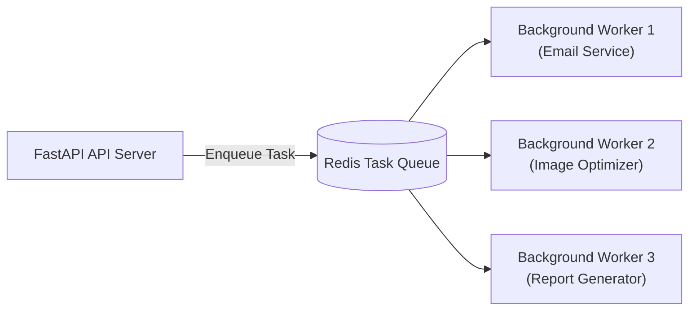

# 🗺️ Chiến lược & Lộ trình Phát triển Hệ thống (Development Roadmap)

Tài liệu này tổng hợp toàn diện các định hướng, đề xuất nâng cấp kiến trúc, tính năng nghiệp vụ và quy trình vận hành cho **Enterprise Premium E-Commerce Platform**, giúp đưa hệ thống từ mức chuẩn mực kỹ thuật hiện tại lên quy mô thương mại hóa thực tế (Production-Ready) cấp độ doanh nghiệp.

---

## 📌 Mục lục

- [1. Hiện trạng Hệ thống (Current Baseline)](#1-hiện-trạng-hệ-thống-current-baseline)
- [2. Trụ cột 1: Tối ưu Kiến trúc & Mã nguồn Frontend (Code Quality & UX)](#2-trụ-cột-1-tối-ưu-kiến-trúc--mã-nguồn-frontend-code-quality--ux)
- [3. Trụ cột 2: Nghiệp vụ Thương mại Thực tế (Core E-Commerce & Business Growth)](#3-trụ-cột-2-nghiệp-vụ-thương-mại-thực-tế-core-e-commerce--business-growth)
- [4. Trụ cột 3: Kiến trúc Bất đồng bộ & Hàng đợi Tác vụ nền (Async Workers & Jobs)](#4-trụ-cột-3-kiến-trúc-bất-đồng-bộ--hàng-đợi-tác-vụ-nền-async-workers--jobs)
- [5. Trụ cột 4: Tìm kiếm Nâng cao & Cá nhân hóa (Search & AI Recommendation)](#5-trụ-cột-4-tìm-kiếm-nâng-cao--cá-nhân-hóa-search--ai-recommendation)
- [6. Trụ cột 5: DevOps, Bảo mật & Khả năng Quan sát Nâng cao (Observability & GitOps)](#6-trụ-cột-5-devops-bảo-mật--khả-năng-quan-sát-nâng-cao-observability--gitops)
- [7. Ma trận Ưu tiên Thực thi (Priority Matrix: Impact vs. Effort)](#7-ma-trận-ưu-tiên-thực-thi-priority-matrix-impact-vs-effort)
- [8. Đề xuất Kế hoạch Hành động Ngay (Immediate Action Plan)](#8-đề-xuất-kế-hoạch-hành-động-ngay-immediate-action-plan)

---

## 1. Hiện trạng Hệ thống (Current Baseline)

Hệ thống hiện tại đã sở hữu nền tảng công nghệ rất vững vàng:
- **Backend**: FastAPI (Python 3.12, Async/Await), SQLAlchemy 2.0 Async, Pydantic v2, PostgreSQL 16 qua connection pooler PgBouncer, Redis 7 (caching, token rotation, sessions).
- **Concurrency & Transaction Integrity**: Pessimistic Locking (`SELECT FOR UPDATE`) chống bán âm kho (Overselling), Optimistic Locking với `version`, quản lý giao dịch an toàn.
- **Frontend**: React 18, TypeScript, Vite, TailwindCSS, Zustand/Context API, kiến trúc SPA.
- **Hạ tầng & Vận hành**: Cụm Kubernetes (Minikube/Kind/Cloud), Nginx Ingress Controller, StatefulSets với Persistent Volumes (Postgres, Redis), HPA Auto-Scaling (3 đến 8 pods theo CPU metrics), Prometheus Scraper và Grafana Dashboard giám sát 11 chỉ số theo thời gian thực.

---

## 2. Trụ cột 1: Tối ưu Kiến trúc & Mã nguồn Frontend (Code Quality & UX)

### 2.1. Tái cấu trúc (Refactor) Trang Quản trị (`Admin.tsx`)
- **Vấn đề**: File `frontend/src/pages/Admin.tsx` hiện có dung lượng lớn (~87KB, hơn 2.000 dòng code), tích hợp toàn bộ các tab quản lý sản phẩm, danh mục, thương hiệu, voucher, đơn hàng, người dùng và sao lưu dữ liệu.
- **Giải pháp**:
  - Tách thành các sub-components độc lập đặt trong `frontend/src/pages/admin/`:
    - `AdminOverview.tsx`: Thống kê doanh thu, biểu đồ tóm tắt.
    - `AdminProducts.tsx`: Danh sách, thêm/sửa/xóa sản phẩm, quản lý tồn kho.
    - `AdminOrders.tsx`: Quản lý trạng thái và duyệt đơn hàng.
    - `AdminVouchers.tsx`: Tạo mã giảm giá, giới hạn ngân sách và lượt dùng.
    - `AdminBackups.tsx`: Kích hoạt và phục hồi snapshot cơ sở dữ liệu.
  - Sử dụng React `lazy()` và `Suspense` để code-splitting, giảm đáng kể thời gian tải trang ban đầu (Initial Bundle Size).

### 2.2. Nâng cao Trải nghiệm Người dùng (UX/UI Enhancements)
- **Hệ thống Toast Notification tập trung**: Chuẩn hóa thông báo lỗi/thành công, tích hợp trạng thái tải (Loading skeletons thay vì spinner đơn điệu).
- **Hỗ trợ Giao diện Tối (Dark Mode)**: Lưu tùy chọn vào `localStorage` hoặc cấu hình hệ thống người dùng (`prefers-color-scheme`).
- **Tối ưu Mobile First & Touch Interactions**: Cải thiện giỏ hàng dạng trượt (Slide-over Cart Drawer) cho thiết bị di động.

---

## 3. Trụ cột 2: Nghiệp vụ Thương mại Thực tế (Core E-Commerce & Business Growth)

### 3.1. Tích hợp Cổng Thanh toán Thực tế (Real-world Payment Gateways)
- **Cổng thanh toán mục tiêu**: PayOS (phổ biến, chuẩn Open Banking VietQR tại Việt Nam), VNPay, MoMo hoặc ZaloPay.
- **Giải pháp kỹ thuật**:
  - **Webhook Receiver**: Nhận IPN (Instant Payment Notification) từ cổng thanh toán.
  - **Bảo mật chữ ký số**: Kiểm tra chữ ký điện tử HMAC-SHA256 để chống giả mạo thông báo thanh toán.
  - **Idempotency Key**: Đảm bảo an toàn giao dịch, nếu webhook gửi lại nhiều lần thì trạng thái đơn và trừ tiền chỉ được thực thi duy nhất 1 lần.
  - **Tự động hủy đơn & Hoàn tiền (Refund/Auto-cancel)**: Hủy đơn nếu sau thời gian quy định (ví dụ 15 phút) khách hàng không quét mã QR thanh toán.

### 3.2. Tích hợp Đơn vị Vận chuyển (Logistics Integration)
- **Đối tác**: Giao Hàng Nhanh (GHN API) hoặc Giao Hàng Tiết Kiệm (GHTK API).
- **Tính năng**:
  - Tự động tra cứu phí vận chuyển và thời gian dự kiến giao hàng dựa trên địa chỉ tỉnh/huyện/xã của khách.
  - Tự động tạo vận đơn (Order Shipping Request) khi Admin duyệt đơn.
  - Lưu và hiển thị mã vận đơn (Tracking Code) kèm lộ trình di chuyển của gói hàng trực tiếp trên trang chi tiết đơn hàng.

### 3.3. Phân hệ Flash Sale & Đặt chỗ Kho Cấp tốc (Flash Sale Engine)
- **Mục tiêu**: Hỗ trợ các sự kiện siêu sale lượng truy cập cực cao (Black Friday, 11/11).
- **Giải pháp**:
  - Sử dụng Redis Atomic Counter (`DECRBY`) hoặc Redis Lua Script để giữ chỗ sản phẩm (Hold Inventory) ngay khi người dùng bước vào checkout.
  - Khóa tồn kho có thời hạn (TTL 10 phút). Nếu không hoàn tất thanh toán, Redis tự động hoàn trả số lượng về kho hàng chính mà không cần lock bảng PostgreSQL.
  - Đồng hồ đếm ngược thời gian thực (Real-time Countdown Timer) trên giao diện.

### 3.4. Hệ thống Đánh giá & Bình luận Đã xác thực (Verified Customer Reviews)
- **Tính năng**:
  - Chỉ cho phép người dùng đã mua hàng và đơn hàng ở trạng thái `DELIVERED` (Đã giao thành công) gửi đánh giá.
  - Đánh giá từ 1 đến 5 sao, kèm bình luận và tải lên tối đa 3-5 hình ảnh chụp thực tế sản phẩm.
  - Huy hiệu **"Người mua đã xác thực" (Verified Purchase)** tăng uy tín cho cửa hàng.

---

## 4. Trụ cột 3: Kiến trúc Bất đồng bộ & Hàng đợi Tác vụ nền (Async Workers & Jobs)

### 4.1. Kiến trúc Task Queue (ARQ hoặc Celery + Redis)
Hiện tại, Backend đang xử lý tuần tự trong luồng HTTP. Cần tách các tác vụ tốn thời gian ra Worker chạy ngầm:

- **Dịch vụ Email Tự động (Email Notification Service)**:
  - Gửi email chào mừng khi đăng ký tài khoản.
  - Gửi hóa đơn điện tử và thông báo xác nhận đơn hàng đính kèm file PDF.
  - Gửi mã OTP / link đặt lại mật khẩu an toàn.
- **Tối ưu hóa Hình ảnh (Media Processing)**:
  - Tự động nén ảnh sang định dạng WebP, tạo đa kích thước (thumbnail 150x150, medium 600x600, full-size) ngay khi Admin tải ảnh lên.
  - Giảm tải băng thông và cải thiện đáng kể điểm Google Core Web Vitals (LCP/FID).
- **Xuất Báo cáo Doanh thu Định kỳ**:
  - Xuất file Excel/CSV danh sách đơn hàng, doanh thu theo ngày/tuần/tháng mà không gây nghẽn kết nối database chính.

---

## 5. Trụ cột 4: Tìm kiếm Nâng cao & Cá nhân hóa (Search & AI Recommendation)

### 5.1. Nâng cấp Công cụ Tìm kiếm Sản phẩm
- **Hạn chế hiện tại**: Truy vấn SQL `ILIKE '%query%'` chậm khi dữ liệu lớn, dễ gây full-table scan và không hỗ trợ gõ không dấu/sai chính tả tiếng Việt.
- **Giải pháp**:
  - **Tùy chọn A (Nhẹ, tận dụng Postgres)**: Dùng PostgreSQL `pg_trgm` (trigram) và `tsvector` cho Full-Text Search.
  - **Tùy chọn B (Chuyên dụng, chuẩn E-Commerce)**: Tích hợp **Meilisearch** làm search engine:
    - Tìm kiếm siêu tốc (dưới 50ms).
    - Hỗ trợ Typo-tolerance (chấp nhận gõ sai chính tả nhẹ).
    - Hỗ trợ tiếng Việt không dấu (ví dụ: gõ "ao thun" ra "áo thun").
    - Hỗ trợ Faceted Search: lọc tức thì theo kích cỡ, màu sắc, khoảng giá, thương hiệu.

### 5.2. Gợi ý Sản phẩm Thông minh (AI Recommendation Engine)
- Tích hợp **pgvector** trong PostgreSQL:
  - Vector hóa tên, mô tả và danh mục sản phẩm thành Vector Embeddings.
  - Tính năng *"Sản phẩm tương tự"* (Semantic Similarity) hiển thị ở cuối trang chi tiết sản phẩm.
  - Thuật toán *"Khách hàng thường mua cùng"* (Collaborative Filtering / Market Basket Analysis) gợi ý thêm sản phẩm vào giỏ hàng.

---

## 6. Trụ cột 5: DevOps, Bảo mật & Khả năng Quan sát Nâng cao (Observability & GitOps)

### 6.1. Thu thập & Quản lý Log Tập trung (Grafana Loki + Promtail)
- Hiện tại hệ thống đã có Prometheus + Grafana giám sát Metric nhưng việc xem log Pods vẫn phải dùng `kubectl logs`.
- Tích hợp **Loki** và **Promtail DaemonSet**:
  - Gom toàn bộ log từ Backend Pods, Ingress Controller Nginx, Postgres và PgBouncer về một nơi.
  - Cho phép lọc log, tìm kiếm từ khóa lỗi (`500`, `Traceback`, `FATAL`) trực tiếp trên giao diện Grafana mà không cần SSH vào máy chủ.

### 6.2. Distributed Tracing (OpenTelemetry + Tempo / Jaeger)
- Theo dõi toàn bộ hành trình (Trace) của 1 request người dùng:
  `Client Browser -> Ingress -> Backend Controller -> Redis Cache -> PgBouncer -> PostgreSQL query execution`.
  - Giúp định danh chính xác câu lệnh SQL hay hàm nào gây nghẽn khi hệ thống chịu tải cao.

### 6.3. Chuẩn hóa Đóng gói Helm Charts & GitOps
- Chuyển đổi toàn bộ thư mục `k8s/` thành một **Helm Chart** chuẩn hóa:
  - Tách riêng file `values-dev.yaml`, `values-staging.yaml`, `values-prod.yaml`.
  - Quản lý hạ tầng theo triết lý **GitOps** kết hợp **ArgoCD**, tự động đồng bộ trạng thái khi có commit mới trên nhánh `main`.

---

## 7. Ma trận Ưu tiên Thực thi (Priority Matrix: Impact vs. Effort)

| STT | Hạng mục công việc | Mức độ Tác động (Impact) | Độ phức tạp (Effort) | Thời gian ước tính | Mức độ Ưu tiên |
| :---: | :--- | :---: | :---: | :---: | :---: |
| **1** | **Refactor modularize [Admin.tsx](file:///home/tringuyen/Documents/GitHub/ecommerce/frontend/src/pages/Admin.tsx)** | Cao | Thấp | 1 - 2 ngày | 🔴 **P1 (Làm ngay)** |
| **2** | **Tích hợp cổng thanh toán thực tế (PayOS / VietQR / VNPay)** | Rất cao | Trung bình | 2 - 3 ngày | 🔴 **P1 (Làm ngay)** |
| **3** | **Đánh giá & Bình luận sản phẩm (Verified Reviews & Ratings)** | Cao | Trung bình | 2 ngày | 🟡 **P2 (Nên làm)** |
| **4** | **Async Worker gửi Email xác nhận đơn hàng & nén ảnh WebP** | Cao | Trung bình | 2 - 3 ngày | 🟡 **P2 (Nên làm)** |
| **5** | **Tìm kiếm tiếng Việt thông minh (Meilisearch hoặc Postgres FTS)** | Cao | Trung bình | 2 ngày | 🟡 **P2 (Nên làm)** |
| **6** | **Flash Sale Engine với Redis Atomic Hold** | Cao | Trung bình - Cao | 3 ngày | 🟢 **P3 (Giai đoạn sau)** |
| **7** | **Loki Log Aggregation & OpenTelemetry Tracing trên Grafana** | Trung bình | Trung bình | 2 ngày | 🟢 **P3 (Giai đoạn sau)** |
| **8** | **AI Product Recommendation (pgvector)** | Trung bình - Cao | Cao | 3 - 4 ngày | 🟢 **P3 (Giai đoạn sau)** |

---

## 8. Đề xuất Kế hoạch Hành động Ngay (Immediate Action Plan)

Để đạt được hiệu quả rõ rệt nhất mà không làm xáo trộn hệ thống đang chạy ổn định, lộ trình 3 bước tiếp theo được khuyến nghị như sau:

### Bước 1: Dọn dẹp nợ kỹ thuật (Technical Debt)
- Phân tách `Admin.tsx` thành các module nhỏ, kiểm thử đảm bảo giao diện quản trị mượt mà, sẵn sàng đón các tính năng mới.

### Bước 2: Hiện thực hóa dòng tiền (Real Payment Flow)
- Đăng ký môi trường Sandbox cổng thanh toán (ví dụ: PayOS - hỗ trợ tạo link VietQR chuyển khoản ngân hàng hoàn toàn miễn phí và nhanh chóng).
- Viết endpoint tiếp nhận Webhook, cập nhật trạng thái đơn hàng sang `PAID` tự động khi khách thanh toán thành công.

### Bước 3: Hoàn thiện tính năng tương tác khách hàng
- Bổ sung bảng cơ sở dữ liệu `reviews` cho phép người dùng đánh giá và xếp hạng sản phẩm.
